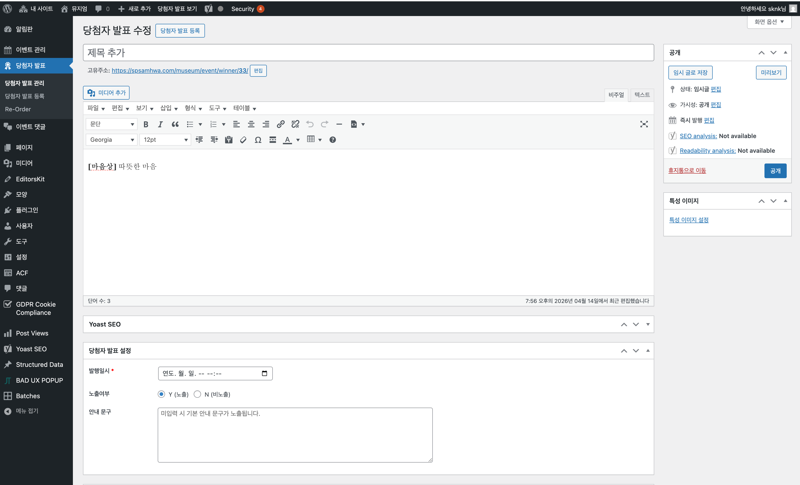

---

## 1.2.3.1 당첨자 발표 메뉴

### 메뉴 접근

좌측 메뉴에서 **당첨자 발표**를 클릭하면 하위 메뉴가 표시됩니다:

| 메뉴 | 설명 |
|------|------|
| **당첨자 발표 관리** | 등록된 당첨자 발표 목록 |
| **당첨자 발표 등록** | 새 당첨자 발표 작성 |
| **Re-Order** | 당첨자 발표 순서 변경 |

---

## 1.2.3.2 당첨자 발표 목록

### 목록 화면

**당첨자 발표** > **당첨자 발표 관리** 클릭 시 등록된 당첨자 발표 목록이 표시됩니다.

### 목록 구성

| 컬럼 | 설명 |
|------|------|
| **제목** | 당첨자 발표 제목 (클릭하여 편집) |
| **발행일시** | 발표 일시 |
| **노출** | Y(노출) / N(비노출) |
| **날짜** | 등록일 |

---

## 1.2.3.3 새 당첨자 발표 등록

### 템플릿 복사 방식 (권장)

새 당첨자 발표 등록 시, **기존 당첨자 발표 게시물의 템플릿을 복사하여 텍스트만 수정**하는 방식으로 작성하세요.

- **복사 방법**

1. **당첨자 발표 관리** 목록에서 기존 게시물 **제목** 클릭
2. 편집 화면에서 본문 영역 전체 선택 (Ctrl+A / Cmd+A)
3. 복사 (Ctrl+C / Cmd+C)
4. 새 당첨자 발표 등록 화면으로 이동
5. 본문에 붙여넣기 (Ctrl+V / Cmd+V)
6. 텍스트 내용만 수정 (당첨자 이름, 작품명 등)

- **주의사항**

> **경고**: 기존 템플릿의 HTML 구조를 변경하거나 새로운 요소를 추가하면 **프론트엔드 스타일이 깨질 수 있습니다**. 기존 템플릿에 맞춰 스타일이 적용되어 있으므로, 반드시 텍스트 내용만 수정하세요.

- 템플릿 구조 변경 금지
- 새로운 테이블/div 추가 금지
- 기존 클래스명 수정 금지

### 등록 방법

1. **당첨자 발표 등록** 버튼 클릭 (목록 상단)
2. 또는 좌측 메뉴에서 **당첨자 발표** > **당첨자 발표 등록** 클릭

### 기본 정보 입력

- **제목**

- 당첨자 발표의 제목을 입력합니다
- 예: "[마음상] 따뜻한 마음"

- **고유주소 (URL)**

- 제목 입력 시 자동 생성됩니다
- **편집** 버튼 클릭하여 수정 가능
- 예: `https://spsamhwa.com/museum/event/winner/33/`

- **내용 (본문)**

에디터로 당첨자 발표 상세 내용을 작성합니다:

| 탭 | 설명 |
|---|------|
| **비주얼** | 서식이 적용된 편집 화면 |
| **텍스트** | HTML 직접 편집 |

**미디어 추가** 버튼으로 이미지, 파일 등을 삽입할 수 있습니다.

---

## 1.2.3.4 당첨자 발표 설정

편집 화면 하단의 **당첨자 발표 설정** 섹션에서 상세 옵션을 설정합니다.

### 발행일시 (필수)

당첨자 발표가 공개되는 날짜와 시간을 설정합니다.

- 날짜 선택 필드 클릭
- 캘린더에서 날짜 및 시간 선택
- 형식: 연도. 월. 일. -- --:--

### 노출여부

웹사이트에 당첨자 발표 노출 여부를 설정합니다.

| 옵션 | 설명 |
|------|------|
| **Y (노출)** | 웹사이트에 표시됨 |
| **N (비노출)** | 웹사이트에 표시되지 않음 |

- 본 항목은 우측 사이드바의 **공개** 패널 내 **가시성** 설정보다 우선 적용됩니다.
- 따라서 본 항목에서 **N**을 선택한 경우, **가시성**이 공개로 설정되어 있더라도 게시글은 노출되지 않습니다.

### 안내 문구

당첨자 발표 페이지에 표시할 안내 문구를 입력합니다.

- 미입력 시 기본 안내 문구가 노출됩니다
- 예: 축하 메시지, 상품 수령 안내 등

---

## 1.2.3.5 특성 이미지 설정

우측 사이드바의 **특성 이미지** 섹션에서 대표 이미지를 설정합니다.

1. **특성 이미지 설정** 클릭
2. 미디어 라이브러리에서 이미지 선택 또는 새로 업로드
3. **특성 이미지로 설정** 클릭

### 권장 이미지 규격

| 용도 | 권장 크기 | 형식 |
|------|----------|------|
| 특성 이미지 | 1200 x 630px | JPG, WebP |
| 본문 이미지 | 1920 x 1080px | JPG, WebP |

---

## 1.2.3.6 발행하기

### 공개 패널

우측 사이드바의 **공개** 패널에서 발행 옵션을 설정합니다.

| 옵션 | 설명 |
|------|------|
| **임시 글로 저장** | 발행하지 않고 저장만 |
| **미리보기** | 발행 전 미리보기 |
| **상태** | 발행됨 / 임시글 |
| **가시성** | 공개 / 비공개 |
| **즉시 발행** | 발행 일시 설정 |

- 본 항목은 당첨자 발표 설정의 **노출 여부**를 **Y**로 설정한 경우에만 적용되며, 게시글 공개 시 반드시 함께 설정해 주시기 바랍니다.

### 새 당첨자 발표 발행

1. 모든 필수 항목 입력 완료
2. **공개** 버튼 클릭

### 기존 당첨자 발표 업데이트

1. 내용 수정 후
2. **업데이트** 버튼 클릭

---

## 1.2.3.7 당첨자 발표 수정

### 수정 방법

1. 당첨자 발표 목록에서 수정할 항목 **제목** 클릭
2. 편집 화면에서 내용 수정
3. **업데이트** 클릭

---

## 1.2.3.8 당첨자 발표 삭제

### 휴지통으로 이동

1. 편집 화면에서 **휴지통으로 이동** 링크 클릭
2. 또는 목록에서 마우스 오버 후 **휴지통** 클릭

### 영구 삭제

1. **휴지통** 탭 클릭
2. **영구 삭제** 클릭

> **주의**: 영구 삭제된 항목은 복구할 수 없습니다.

---

## 1.2.3.9 순서 변경

좌측 메뉴의 **당첨자 발표** > **Re-Order**에서 당첨자 발표 순서를 드래그 앤 드롭으로 변경할 수 있습니다.

---

## 1.2.3.10 자주 묻는 질문

### Q: 당첨자 발표가 웹사이트에 표시되지 않아요

**A**: 다음을 확인하세요:
- **노출여부**가 Y(노출)로 설정되어 있는지
- **상태**가 발행됨인지
- **발행일시**가 현재 시간 이전인지

### Q: 발행일시를 변경하고 싶어요

**A**: 
1. 당첨자 발표 편집 화면 접속
2. **당첨자 발표 설정** > **발행일시** 수정
3. **업데이트** 클릭

### Q: 당첨자 이름을 일부만 표시하고 싶어요

**A**: 본문에 당첨자 이름 입력 시 직접 마스킹하여 입력하세요.
- 예: "김**", "이*진", "박민*"
