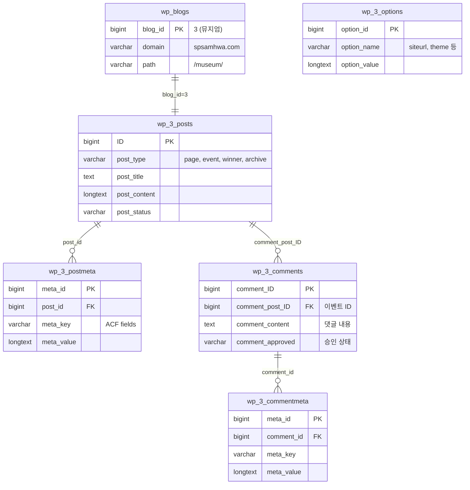
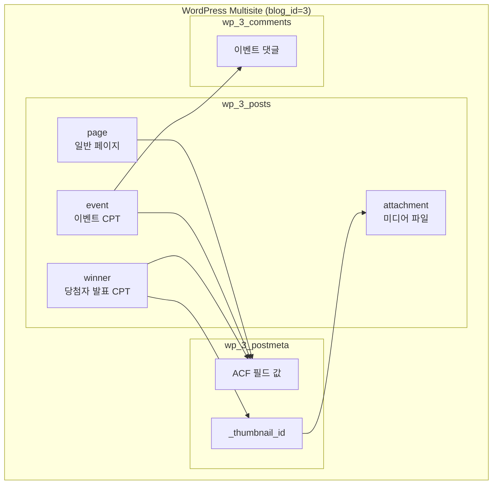

# 2.3. 테이블 정의서

---

## 1. 개요

SP100주년 뮤지엄 사이트는 WordPress Multisite의 blog_id=3으로 운영됩니다.  
WordPress 멀티사이트 구조에 따라 `wp_3_*` 접두사를 가진 테이블을 사용합니다.

### 1.1 테이블 네이밍 규칙

| blog_id | 접두사 | 사이트 |
|---------|--------|--------|
| 1 | `wp_` | 국문 메인 |
| 2 | `wp_2_` | 영문 |
| 3 | `wp_3_` | **뮤지엄** |

---

## 2. 사용 테이블 목록

### 2.1 핵심 테이블

| 테이블명 | 용도 | museum 사용 |
|----------|------|-------------|
| `wp_3_posts` | 페이지, 포스트, CPT 저장 | ✅ 필수 |
| `wp_3_postmeta` | 포스트 메타데이터 (ACF 필드 포함) | ✅ 필수 |
| `wp_3_options` | 사이트 설정 | ✅ 필수 |
| `wp_3_comments` | 이벤트 댓글 | ✅ 사용 |
| `wp_3_commentmeta` | 댓글 메타데이터 | ✅ 사용 |

### 2.2 보조 테이블

| 테이블명 | 용도 | museum 사용 |
|----------|------|-------------|
| `wp_3_terms` | 카테고리/태그 정의 | △ 선택적 |
| `wp_3_term_taxonomy` | 택소노미 관계 | △ 선택적 |
| `wp_3_term_relationships` | 포스트-택소노미 연결 | △ 선택적 |
| `wp_3_termmeta` | 택소노미 메타 | △ 선택적 |
| `wp_3_links` | 링크 (미사용) | ✗ |
| `wp_3_usermeta` | 사용자 메타 | △ 권한용 |

### 2.3 공유 테이블 (멀티사이트 공통)

| 테이블명 | 용도 | 비고 |
|----------|------|------|
| `wp_users` | 사용자 계정 | 전체 사이트 공유 |
| `wp_usermeta` | 사용자 메타 | `wp_3_capabilities` 포함 |
| `wp_blogs` | 사이트 목록 | blog_id=3 행 |
| `wp_sitemeta` | 네트워크 설정 | allowedthemes 등 |
| `wp_site` | 네트워크 정보 | - |

---

## 3. 테이블 상세 정의

### 3.1 wp_3_posts

**설명**: 페이지, 포스트, Custom Post Type 저장

| 컬럼명 | 타입 | 설명 | 예시 |
|--------|------|------|------|
| ID | bigint(20) | 포스트 고유 ID | 1, 2, 3... |
| post_author | bigint(20) | 작성자 ID | 1 |
| post_date | datetime | 작성일시 | 2026-04-20 10:00:00 |
| post_content | longtext | 본문 내용 | HTML 콘텐츠 |
| post_title | text | 제목 | "80주년 히스토리" |
| post_status | varchar(20) | 상태 | publish, draft |
| post_name | varchar(200) | URL 슬러그 | "80-years" |
| post_type | varchar(20) | 포스트 타입 | page, event, winner |
| post_parent | bigint(20) | 부모 포스트 ID | 0 |
| menu_order | int(11) | 정렬 순서 | 0, 1, 2... |

**사용되는 post_type**:

| post_type | 설명 | 템플릿 |
|-----------|------|--------|
| `page` | 일반 페이지 | page-*.php |
| `event` | 이벤트 (CPT) | single-event.php |
| `winner` | 수상작 (CPT) | single-winner.php |
| `archive` | 아카이브 (CPT) | page-archive-100.php |

---

### 3.2 wp_3_postmeta

**설명**: 포스트 메타데이터 (ACF 필드 값 저장)

| 컬럼명 | 타입 | 설명 |
|--------|------|------|
| meta_id | bigint(20) | 메타 고유 ID |
| post_id | bigint(20) | 연결된 포스트 ID |
| meta_key | varchar(255) | 메타 키 |
| meta_value | longtext | 메타 값 |

**주요 meta_key 패턴**:

| 패턴 | 설명 | 예시 |
|------|------|------|
| `_edit_lock` | 편집 잠금 | 시스템 |
| `_thumbnail_id` | 대표 이미지 ID | 123 |
| `_wp_page_template` | 페이지 템플릿 | page-80-years.php |
| `field_*` | ACF 필드 참조 키 | field_648xxxxx |
| `[field_name]` | ACF 필드 값 | 커스텀 데이터 |

---

### 3.3 wp_3_comments

**설명**: 이벤트 댓글 저장

| 컬럼명 | 타입 | 설명 |
|--------|------|------|
| comment_ID | bigint(20) | 댓글 고유 ID |
| comment_post_ID | bigint(20) | 연결된 이벤트 ID |
| comment_author | tinytext | 작성자명 |
| comment_author_email | varchar(100) | 이메일 |
| comment_date | datetime | 작성일시 |
| comment_content | text | 댓글 내용 |
| comment_approved | varchar(20) | 승인 상태 (0, 1, spam) |
| comment_parent | bigint(20) | 부모 댓글 ID (답글) |
| user_id | bigint(20) | 로그인 사용자 ID |

---

### 3.4 wp_3_options

**설명**: 사이트 설정값 저장

| 컬럼명 | 타입 | 설명 |
|--------|------|------|
| option_id | bigint(20) | 옵션 고유 ID |
| option_name | varchar(191) | 옵션 이름 |
| option_value | longtext | 옵션 값 |
| autoload | varchar(20) | 자동 로드 여부 |

**뮤지엄 사이트 주요 옵션**:

| option_name | 값 | 설명 |
|-------------|-----|------|
| siteurl | https://spsamhwa.com/museum | 사이트 URL |
| home | https://spsamhwa.com/museum | 홈 URL |
| blogname | 뮤지엄 | 사이트명 |
| template | sknk | 부모 테마 |
| stylesheet | sknk_80 | 활성 테마 |
| WPLANG | ko_KR | 언어 |

---

### 3.5 wp_blogs (공유)

**설명**: 멀티사이트 목록

| 컬럼명 | 타입 | 설명 |
|--------|------|------|
| blog_id | bigint(20) | 사이트 ID |
| site_id | bigint(20) | 네트워크 ID |
| domain | varchar(200) | 도메인 |
| path | varchar(100) | 경로 |
| registered | datetime | 등록일 |
| public | tinyint(2) | 공개 여부 |

**뮤지엄 행**:
```
blog_id: 3
domain: spsamhwa.com
path: /museum/
```

---

## 4. Custom Post Type 정의

### 4.1 event (이벤트)

**정의 위치**: `sknk_80/inc/event-cpt.php`

| 속성 | 값 |
|------|-----|
| post_type | event |
| 라벨 | 이벤트 |
| public | true |
| has_archive | true |
| supports | title, editor, thumbnail |

### 4.2 winner (수상작)

**정의 위치**: `sknk_80/inc/event-cpt.php`

| 속성 | 값 |
|------|-----|
| post_type | winner |
| 라벨 | 수상작 |
| public | true |
| has_archive | false |
| supports | title, editor, thumbnail |

### 4.3 archive (아카이브)

**정의 위치**: `sknk_80/inc/archive-cpt.php`

| 속성 | 값 |
|------|-----|
| post_type | archive |
| 라벨 | 아카이브 |
| public | true |
| has_archive | false |
| supports | title, editor, thumbnail |
| menu_icon | dashicons-images-alt2 |

**커스텀 메타 필드**:

| meta_key | 타입 | 설명 |
|----------|------|------|
| `archive_category` | text | 카테고리 분류명 |
| `category_visible` | select (Y/N) | 카테고리 프론트 표시 여부 |
| `title_visible` | select (Y/N) | 제목 프론트 표시 여부 |
| `content_visible` | select (Y/N) | 내용 프론트 표시 여부 |

---

## 5. ACF 필드 그룹 (참조)

> **참고**: ACF 필드는 WordPress 관리자 UI에서 관리됩니다.  
> 코드에서 직접 정의되지 않으며, `wp_3_posts` (post_type='acf-field-group')에 저장됩니다.

### 5.1 필드 확인 방법

```bash
# WP-CLI로 ACF 필드 그룹 조회
ddev wp --url=samhwa.sknkwoxs.com/museum post list --post_type=acf-field-group

# 또는 관리자 화면에서 확인
# Custom Fields > Field Groups
```

### 5.2 코드에서 사용되는 ACF 함수

```php
// 필드 값 조회
$value = get_field('field_name', $post_id);

// 필드 값 저장
update_field('field_name', $value, $post_id);

// 서브필드 (Repeater)
while (have_rows('repeater_field')) {
    the_row();
    $sub = get_sub_field('sub_field');
}
```

---

## 6. 데이터 관계도

### 6.1 전체 구조 (Mermaid)



### 6.2 Post Type 관계



---

## 7. 참고사항

### 7.1 MIS 연동 없음

- 뮤지엄 사이트(blog_id=3)는 MIS(Postgres) 연동이 **없습니다**
- `migration/*.yml` 배치는 blog_id=1, 2에서만 실행됨
- `sknk/inc/register.php`에서 blog_id=3 분기로 제외 처리됨

### 7.2 데이터 백업

```bash
# 뮤지엄 사이트 DB 백업
ddev wp --url=samhwa.sknkwoxs.com/museum db export museum-backup.sql

# 특정 테이블만 백업
ddev wp db export --tables=wp_3_posts,wp_3_postmeta museum-posts.sql
```

### 7.3 데이터 복원

```bash
# DB 복원
ddev wp db import museum-backup.sql

# URL 치환 (개발 ↔ 운영)
ddev wp search-replace 'samhwa.sknkwoxs.com/museum' 'spsamhwa.com/museum' --url=samhwa.sknkwoxs.com/museum
```
