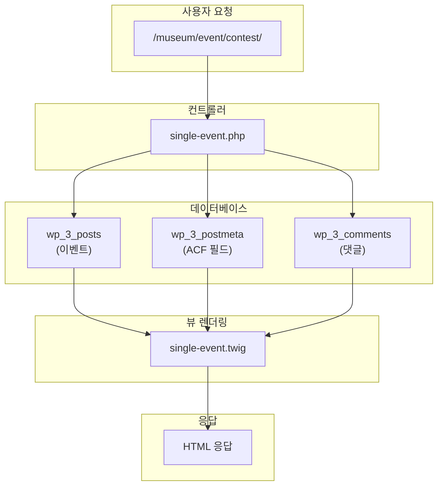

# 2.4. 화면테이블매핑

---

## 1. 매핑 개요

### 1.1 공통 사항

- 모든 페이지는 `wp_3_posts` + `wp_3_postmeta` 기반
- ACF 필드 값은 `wp_3_postmeta`에 저장
- 이미지/미디어는 `wp_3_posts` (post_type='attachment')

---

## 2. 화면별 매핑 상세

### 2.1 메인 페이지 (Home)

| 항목 | 값 |
|------|-----|
| **URL** | `/museum/` |
| **컨트롤러** | `home.php` |
| **템플릿** | `twigs/home.twig` |

| 데이터 | 테이블 | 조건 |
|--------|--------|------|
| 페이지 콘텐츠 | `wp_3_posts` | post_type='page', post_name='home' |
| ACF 필드 | `wp_3_postmeta` | post_id = 페이지ID |
| 대표 이미지 | `wp_3_posts` | ID = _thumbnail_id |

---

### 2.2 80주년 히스토리

| 항목 | 값 |
|------|-----|
| **URL** | `/museum/80-years/` |
| **컨트롤러** | `page-80-years.php` |
| **템플릿** | `twigs/80-years.twig` |

| 데이터 | 테이블 | 조건 |
|--------|--------|------|
| 페이지 콘텐츠 | `wp_3_posts` | post_type='page', post_name='80-years' |
| 연혁 데이터 | `wp_3_postmeta` | ACF Repeater 필드 |
| 이미지 갤러리 | `wp_3_posts` | post_type='attachment' |

---

### 2.3 SP삼화 소개

| 항목 | 값 |
|------|-----|
| **URL** | `/museum/sp-samhwa/` |
| **컨트롤러** | `page-sp-samhwa.php` |
| **템플릿** | `twigs/sp-samhwa.twig` |

| 데이터 | 테이블 | 조건 |
|--------|--------|------|
| 페이지 콘텐츠 | `wp_3_posts` | post_type='page' |
| 소개 섹션 | `wp_3_postmeta` | ACF 필드 |
| 비디오 URL | `wp_3_postmeta` | ACF 필드 |

---

### 2.4 First & Best (최초/최고)

| 항목 | 값 |
|------|-----|
| **URL** | `/museum/first-best/` |
| **컨트롤러** | `page-first-best.php` |
| **템플릿** | `twigs/first-best.twig` |

| 데이터 | 테이블 | 조건 |
|--------|--------|------|
| 페이지 콘텐츠 | `wp_3_posts` | post_type='page' |
| 카드 데이터 | `wp_3_postmeta` | ACF Repeater |
| 팝업 이미지 | `wp_3_posts` | post_type='attachment' |

---

### 2.5 미래 비전 (Future)

| 항목 | 값 |
|------|-----|
| **URL** | `/museum/future/` |
| **컨트롤러** | `page-future.php` |
| **템플릿** | `twigs/future.twig` |

| 데이터 | 테이블 | 조건 |
|--------|--------|------|
| 페이지 콘텐츠 | `wp_3_posts` | post_type='page' |
| 비전 텍스트 | `wp_3_postmeta` | ACF 필드 |
| 배경 비디오 | 정적 파일 | `src/videos/future_bg.mp4` |

---

### 2.6 경영 철학 (Philosophy)

| 항목 | 값 |
|------|-----|
| **URL** | `/museum/philosophy/` |
| **컨트롤러** | `page-philosophy.php` |
| **템플릿** | `twigs/philosophy.twig` |

| 데이터 | 테이블 | 조건 |
|--------|--------|------|
| 페이지 콘텐츠 | `wp_3_posts` | post_type='page' |
| 철학 내용 | `wp_3_postmeta` | ACF 필드 |
| 비디오 | 정적 파일 | `src/videos/philosophy_01.mp4` |

---

### 2.7 연혁 (History)

| 항목 | 값 |
|------|-----|
| **URL** | `/museum/history/` |
| **컨트롤러** | `page-history.php` |
| **템플릿** | - |

| 데이터 | 테이블 | 조건 |
|--------|--------|------|
| 페이지 콘텐츠 | `wp_3_posts` | post_type='page' |
| 연도별 데이터 | `wp_3_postmeta` | ACF Repeater |

---

### 2.8 헤리티지 (Heritage)

| 항목 | 값 |
|------|-----|
| **URL** | `/museum/heritage/` |
| **컨트롤러** | `page-heritage.php` |
| **템플릿** | - |

| 데이터 | 테이블 | 조건 |
|--------|--------|------|
| 페이지 콘텐츠 | `wp_3_posts` | post_type='page' |
| 헤리티지 정보 | `wp_3_postmeta` | ACF 필드 |

---

### 2.9 삼화 아카이브 100 (Archive-100)

| 항목 | 값 |
|------|-----|
| **URL** | `/museum/heritage/archive-100/` |
| **컨트롤러** | `page-archive-100.php` |
| **템플릿** | `twigs/archive-100.twig` |

| 데이터 | 테이블 | 조건 |
|--------|--------|------|
| 아카이브 목록 | `wp_3_posts` | post_type='archive', post_status='publish' |
| 아카이브 메타 | `wp_3_postmeta` | archive_category, category_visible, title_visible, content_visible |
| 썸네일 | `wp_3_posts` | post_type='attachment', ID=_thumbnail_id |

**쿼리 예시**:
```php
$archives = Timber::get_posts([
    'post_type' => 'archive',
    'post_status' => 'publish',
    'posts_per_page' => -1,
    'orderby' => 'date',
    'order' => 'ASC'  // 오래된 순
]);
```

---

### 2.10 이벤트 목록 (Event)

| 항목 | 값 |
|------|-----|
| **URL** | `/museum/event/` |
| **컨트롤러** | `page-event.php` |
| **템플릿** | `twigs/event.twig` |

| 데이터 | 테이블 | 조건 |
|--------|--------|------|
| 이벤트 목록 | `wp_3_posts` | post_type='event', post_status='publish' |
| 이벤트 메타 | `wp_3_postmeta` | ACF 필드 (기간, 상태 등) |
| 썸네일 | `wp_3_posts` | post_type='attachment' |

**쿼리 예시**:
```php
$events = Timber::get_posts([
    'post_type' => 'event',
    'post_status' => 'publish',
    'posts_per_page' => -1,
    'orderby' => 'date',
    'order' => 'DESC'
]);
```

---

### 2.11 이벤트 상세 (Single Event)

| 항목 | 값 |
|------|-----|
| **URL** | `/museum/event/{slug}/` |
| **컨트롤러** | `single-event.php` |
| **템플릿** | `twigs/single-event.twig` |

| 데이터 | 테이블 | 조건 |
|--------|--------|------|
| 이벤트 정보 | `wp_3_posts` | post_type='event', ID=현재 |
| 이벤트 메타 | `wp_3_postmeta` | post_id = 이벤트ID |
| **댓글 목록** | `wp_3_comments` | comment_post_ID = 이벤트ID |
| 댓글 메타 | `wp_3_commentmeta` | comment_id = 댓글ID |

**댓글 쿼리**:
```php
$comments = get_comments([
    'post_id' => $post->ID,
    'status' => 'approve',
    'orderby' => 'comment_date',
    'order' => 'DESC'
]);
```

---

### 2.12 수상작 상세 (Single Winner)

| 항목 | 값 |
|------|-----|
| **URL** | `/museum/winner/{slug}/` |
| **컨트롤러** | `single-winner.php` |
| **템플릿** | `twigs/single-winner.twig` |

| 데이터 | 테이블 | 조건 |
|--------|--------|------|
| 수상작 정보 | `wp_3_posts` | post_type='winner' |
| 수상 정보 | `wp_3_postmeta` | ACF 필드 (수상자, 작품명 등) |
| 이미지 갤러리 | `wp_3_posts` | post_type='attachment' |

---

### 2.13 커밍순 (Coming Soon)

| 항목 | 값 |
|------|-----|
| **URL** | `/museum/coming-soon/` |
| **컨트롤러** | `page-coming-soon.php` |
| **템플릿** | `twigs/coming-soon.twig` |

| 데이터 | 테이블 | 조건 |
|--------|--------|------|
| 페이지 콘텐츠 | `wp_3_posts` | post_type='page' |
| 안내 메시지 | `wp_3_postmeta` | ACF 필드 |

---

## 3. 매핑 요약표

| 화면 | URL | post_type | comments | 비고 |
|------|-----|-----------|----------|------|
| 메인 | `/museum/` | page | - | |
| 80주년 | `/museum/80-years/` | page | - | |
| SP삼화 | `/museum/sp-samhwa/` | page | - | |
| 최초/최고 | `/museum/first-best/` | page | - | |
| 미래 | `/museum/future/` | page | - | |
| 철학 | `/museum/philosophy/` | page | - | |
| 연혁 | `/museum/history/` | page | - | |
| 헤리티지 | `/museum/heritage/` | page | - | |
| 아카이브100 | `/museum/heritage/archive-100/` | archive | - | CPT, 필터/그리드/모달 |
| 이벤트 목록 | `/museum/event/` | event | - | CPT |
| 이벤트 상세 | `/museum/event/*` | event | ✅ | 댓글 사용 |
| 수상작 상세 | `/museum/winner/*` | winner | - | CPT |
| 커밍순 | `/museum/coming-soon/` | page | - | |

---

## 4. 공통 컴포넌트 매핑

### 4.1 헤더 (anniversary-header.twig)

| 데이터 | 소스 |
|--------|------|
| 로고 | 정적 이미지 |
| 메뉴 | WordPress 메뉴 (`wp_3_terms`) |
| 현재 페이지 | `$post->post_name` |

### 4.2 푸터 (anniversary-footer.twig)

| 데이터 | 소스 |
|--------|------|
| 회사 정보 | 정적 텍스트 |
| 링크 | 정적 URL |

### 4.3 메가 메뉴 (mega-menu.twig)

| 데이터 | 소스 |
|--------|------|
| 메뉴 항목 | WordPress 메뉴 또는 하드코딩 |
| 서브메뉴 | ACF 옵션 또는 하드코딩 |

---

## 5. AJAX 엔드포인트 매핑

### 5.1 이벤트 댓글 등록

| 항목 | 값 |
|------|-----|
| **액션** | `wp_ajax_nopriv_event_comment` |
| **파일** | `sknk_80/inc/event-comments.php` |

| 입력 (POST) | 저장 테이블 |
|-------------|-------------|
| post_id | `wp_3_comments.comment_post_ID` |
| author | `wp_3_comments.comment_author` |
| email | `wp_3_comments.comment_author_email` |
| content | `wp_3_comments.comment_content` |

### 5.2 댓글 목록 조회

| 항목 | 값 |
|------|-----|
| **액션** | `wp_ajax_nopriv_get_event_comments` |
| **조회 테이블** | `wp_3_comments` |
| **조건** | comment_post_ID, comment_approved='1' |

---

## 6. 데이터 흐름도



---

## 7. 참고사항

### 7.1 데이터 없는 화면

일부 화면은 DB 조회 없이 정적 콘텐츠만 표시:
- 비디오 배경: `src/videos/` 폴더의 mp4 파일
- 이미지: `src/images/` 폴더의 webp/png 파일
- 텍스트: Twig 템플릿에 하드코딩

### 7.2 캐싱

- WordPress 기본 Object Cache 사용
- 페이지 단위 캐싱은 Yoast SEO 또는 서버 설정 의존
