# SP100주년 뮤지엄 사이트 DB-ERD

> **버전**: 1.0 (간소화)  
> **작성일**: 2026-04-20  
> **특징**: WordPress 기본 테이블 구조 기반

---

## 1. ERD 개요

SP100주년 뮤지엄 사이트는 WordPress Multisite의 blog_id=3으로 운영되며,  
WordPress 표준 테이블 구조를 그대로 사용합니다.

---

## 2. 전체 ERD (Mermaid)

### 2.1 Core Tables (핵심 테이블)

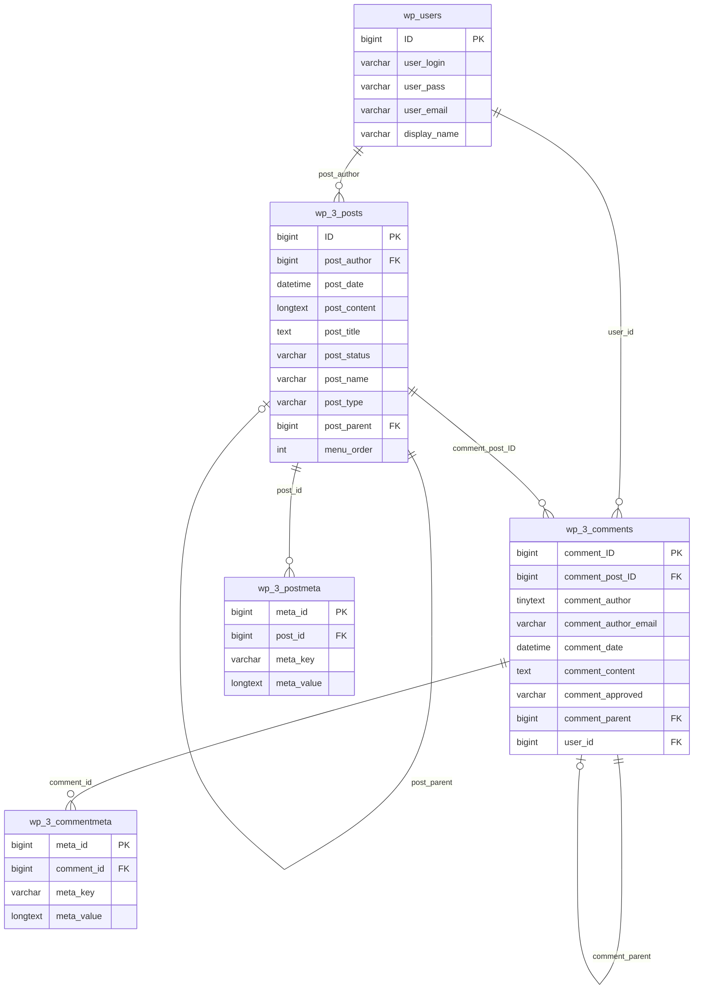

### 2.2 Taxonomy Tables (분류 테이블)

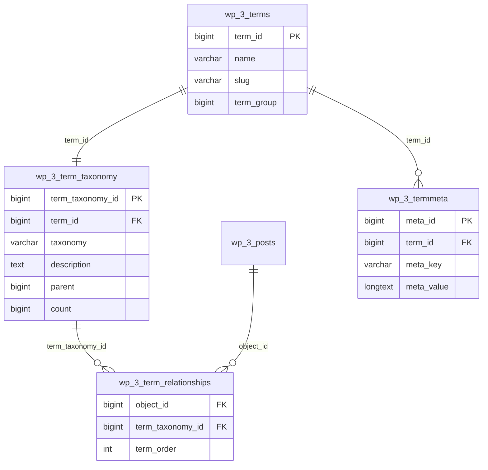

### 2.3 Multisite Shared Tables (공유 테이블)

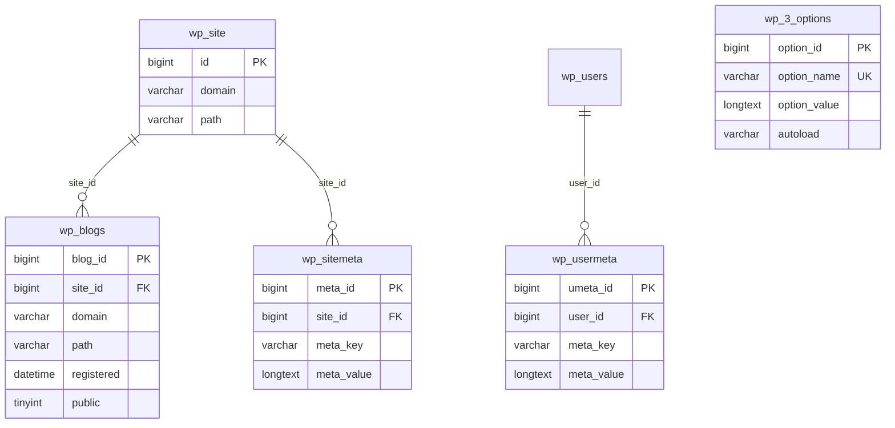

### 2.4 Post Type별 ERD

#### Event (이벤트 CPT)

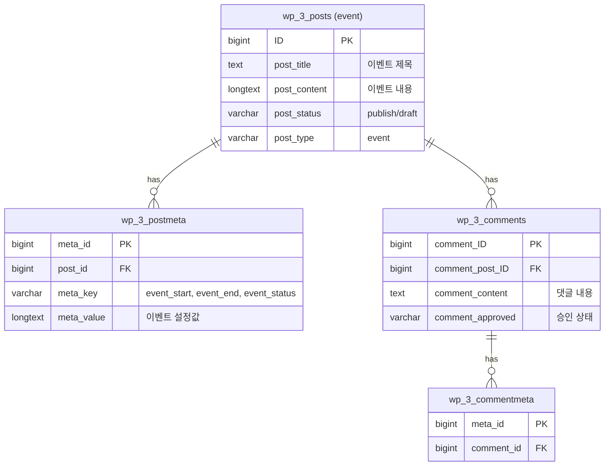

#### Winner (당첨자 발표 CPT)

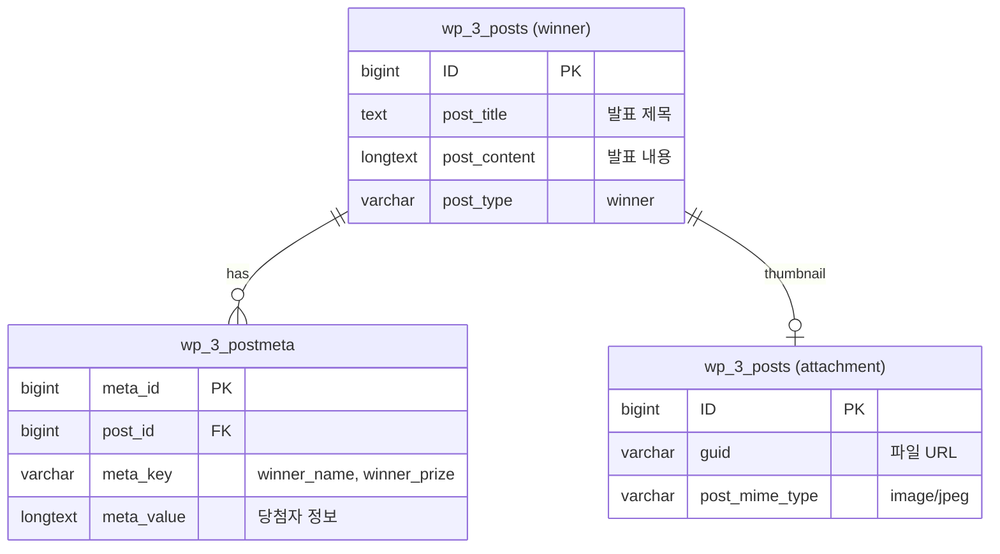

---

## 3. 핵심 관계 설명

### 3.1 Posts ↔ Postmeta (1:N)

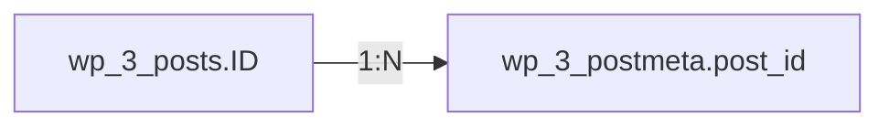

- 하나의 포스트는 여러 메타데이터를 가짐
- ACF 필드 값은 postmeta에 저장됨

### 3.2 Posts ↔ Comments (1:N)

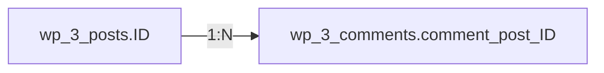

- 이벤트(event) 포스트에 댓글 연결
- 뮤지엄 사이트에서 댓글은 이벤트에만 사용

### 3.3 Comments ↔ Commentmeta (1:N)

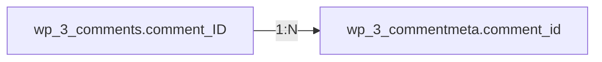

- 댓글 추가 정보 저장용

### 3.4 Posts (Self-reference)

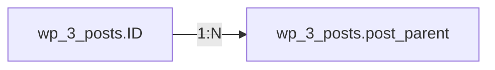

- 페이지 계층 구조
- 첨부파일-부모 포스트 관계

### 3.5 Comments (Self-reference)

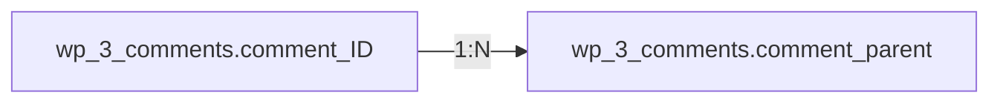

- 대댓글 구조

---

## 4. 테이블별 관계 요약

| 테이블 | PK | FK | 관계 대상 |
|--------|----|----|-----------|
| wp_3_posts | ID | post_author | wp_users |
| wp_3_posts | ID | post_parent | wp_3_posts (self) |
| wp_3_postmeta | meta_id | post_id | wp_3_posts |
| wp_3_comments | comment_ID | comment_post_ID | wp_3_posts |
| wp_3_comments | comment_ID | user_id | wp_users |
| wp_3_comments | comment_ID | comment_parent | wp_3_comments (self) |
| wp_3_commentmeta | meta_id | comment_id | wp_3_comments |
| wp_3_terms | term_id | - | - |
| wp_3_term_taxonomy | term_taxonomy_id | term_id | wp_3_terms |
| wp_3_term_relationships | - | object_id | wp_3_posts |
| wp_3_term_relationships | - | term_taxonomy_id | wp_3_term_taxonomy |
| wp_3_termmeta | meta_id | term_id | wp_3_terms |
| wp_3_options | option_id | - | - |

---

## 5. Post Type별 ERD

### 5.1 Page (페이지)

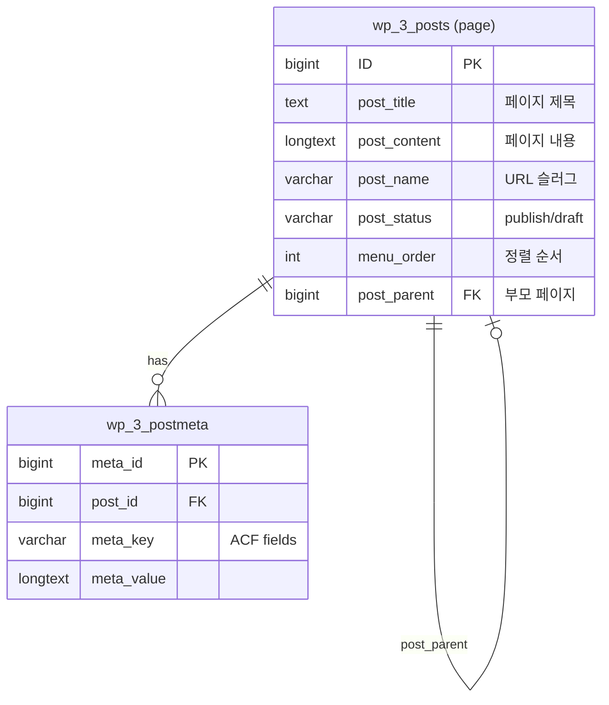

### 5.2 Event (이벤트 CPT)

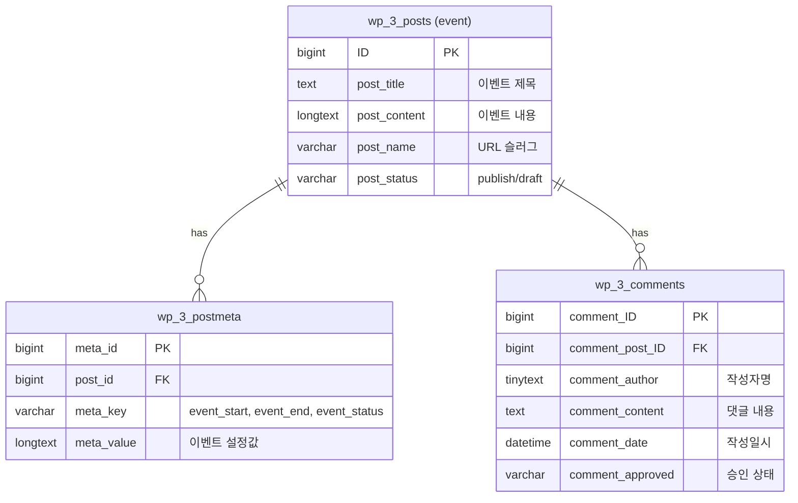

### 5.3 Winner (수상작 CPT)

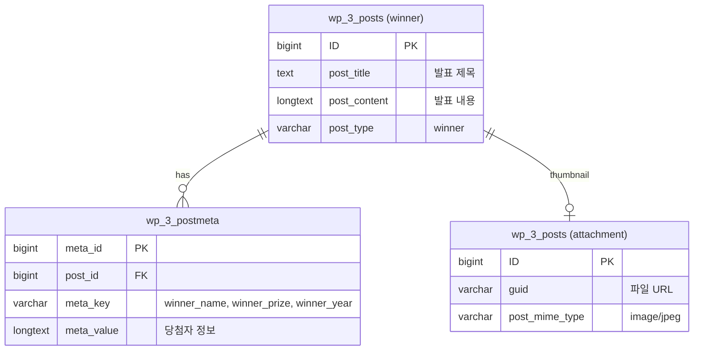

---

## 6. 미디어 관계

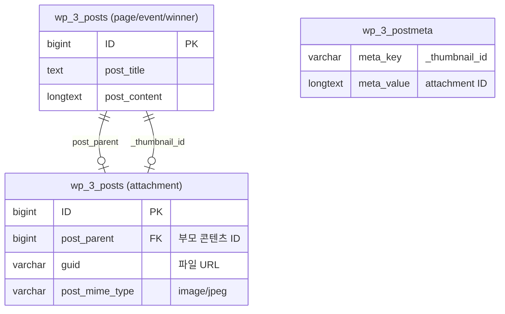

**관계 설명:**
- `post_parent`: 첨부파일이 어느 콘텐츠에 속하는지
- `_thumbnail_id`: 콘텐츠의 대표 이미지(특성 이미지) 참조

---

## 7. ERD 이미지 생성용 DDL (참고)

```sql
-- 주요 테이블만 발췌 (MySQL)
-- 실제 WordPress 테이블은 더 많은 컬럼 포함

CREATE TABLE wp_3_posts (
    ID bigint(20) PRIMARY KEY AUTO_INCREMENT,
    post_author bigint(20),
    post_date datetime,
    post_content longtext,
    post_title text,
    post_status varchar(20),
    post_name varchar(200),
    post_type varchar(20),
    post_parent bigint(20),
    menu_order int(11),
    FOREIGN KEY (post_parent) REFERENCES wp_3_posts(ID),
    FOREIGN KEY (post_author) REFERENCES wp_users(ID)
);

CREATE TABLE wp_3_postmeta (
    meta_id bigint(20) PRIMARY KEY AUTO_INCREMENT,
    post_id bigint(20),
    meta_key varchar(255),
    meta_value longtext,
    FOREIGN KEY (post_id) REFERENCES wp_3_posts(ID)
);

CREATE TABLE wp_3_comments (
    comment_ID bigint(20) PRIMARY KEY AUTO_INCREMENT,
    comment_post_ID bigint(20),
    comment_author tinytext,
    comment_author_email varchar(100),
    comment_date datetime,
    comment_content text,
    comment_approved varchar(20),
    comment_parent bigint(20),
    user_id bigint(20),
    FOREIGN KEY (comment_post_ID) REFERENCES wp_3_posts(ID),
    FOREIGN KEY (comment_parent) REFERENCES wp_3_comments(comment_ID),
    FOREIGN KEY (user_id) REFERENCES wp_users(ID)
);

CREATE TABLE wp_3_commentmeta (
    meta_id bigint(20) PRIMARY KEY AUTO_INCREMENT,
    comment_id bigint(20),
    meta_key varchar(255),
    meta_value longtext,
    FOREIGN KEY (comment_id) REFERENCES wp_3_comments(comment_ID)
);

CREATE TABLE wp_3_options (
    option_id bigint(20) PRIMARY KEY AUTO_INCREMENT,
    option_name varchar(191) UNIQUE,
    option_value longtext,
    autoload varchar(20)
);
```

---

## 8. 참고사항

### 8.1 별도 테이블 없음

- 뮤지엄 사이트는 WordPress 표준 테이블만 사용
- Custom Table 생성 없음
- MIS 연동 없음 (별도 Postgres 연결 없음)

### 8.2 데이터 분리

- blog_id=3 데이터는 `wp_3_*` 테이블에만 저장
- 다른 사이트(blog_id=1,2)와 데이터 분리됨
- 사용자(`wp_users`)만 공유

### 8.3 ERD 도구 추천

시각적 ERD 생성 시 권장 도구:
- MySQL Workbench (Reverse Engineering)
- dbdiagram.io (웹 기반)
- draw.io (다이어그램)
