# 2.5. DB-ERD

---

## 2.5.1 ERD 개요

SP100주년 뮤지엄 사이트는 WordPress Multisite의 blog_id=3으로 운영되며,  
WordPress 표준 테이블 구조를 그대로 사용합니다.

---

## 2.5.2 전체 ERD

### A. Core Tables

### B. Taxonomy Tables

### C. Multisite Shared Tables

### D. Post Type ERD

- **Event CPT**

- **Winner CPT**

---

## 2.5.3 핵심 관계 설명

### A. Posts - Postmeta (1:N)

- 하나의 포스트는 여러 메타데이터를 가짐
- ACF 필드 값은 postmeta에 저장됨

### B. Posts - Comments (1:N)

- 이벤트(event) 포스트에 댓글 연결
- 뮤지엄 사이트에서 댓글은 이벤트에만 사용

### C. Comments - Commentmeta (1:N)

- 댓글 추가 정보 저장용

### D. Posts (Self-reference)

- 페이지 계층 구조
- 첨부파일-부모 포스트 관계

### E. Comments (Self-reference)

- 대댓글 구조

---

## 2.5.4 테이블별 관계 요약

| 테이블 | PK | FK | 관계 대상 |
|--------|----|----|-----------|
| wp_3_posts | ID | post_author | wp_users |
| wp_3_posts | ID | post_parent | wp_3_posts (self) |
| wp_3_postmeta | meta_id | post_id | wp_3_posts |
| wp_3_comments | comment_ID | comment_post_ID | wp_3_posts |
| wp_3_comments | comment_ID | user_id | wp_users |
| wp_3_comments | comment_ID | comment_parent | wp_3_comments (self) |
| wp_3_commentmeta | meta_id | comment_id | wp_3_comments |
| wp_3_terms | term_id | - | - |
| wp_3_term_taxonomy | term_taxonomy_id | term_id | wp_3_terms |
| wp_3_term_relationships | - | object_id | wp_3_posts |
| wp_3_term_relationships | - | term_taxonomy_id | wp_3_term_taxonomy |
| wp_3_termmeta | meta_id | term_id | wp_3_terms |
| wp_3_options | option_id | - | - |

---

## 2.5.5 Post Type별 ERD

### A. Page

### B. Event CPT

### C. Winner CPT

### D. Archive CPT

---

## 2.5.6 미디어 관계

**관계 설명:**
- `post_parent`: 첨부파일이 어느 콘텐츠에 속하는지
- `_thumbnail_id`: 콘텐츠의 대표 이미지(특성 이미지) 참조

---

## 2.5.7 참고사항

### A. 별도 테이블 없음

- 뮤지엄 사이트는 WordPress 표준 테이블만 사용
- Custom Table 생성 없음
- MIS 연동 없음 (별도 Postgres 연결 없음)

### B. 데이터 분리

- blog_id=3 데이터는 `wp_3_*` 테이블에만 저장
- 다른 사이트(blog_id=1,2)와 데이터 분리됨
- 사용자(`wp_users`)만 공유

### C. ERD 도구 추천

시각적 ERD 생성 시 권장 도구:
- MySQL Workbench (Reverse Engineering)
- dbdiagram.io (웹 기반)
- draw.io (다이어그램)
