# 2.6. 프로그램목록정의서

---

## 2.6.1 프로그램 구성 개요

| 구분 | 파일 수 | 설명 |
|------|---------|------|
| 페이지 템플릿 (PHP) | 13개 | 페이지 컨트롤러 |
| Twig 템플릿 | 17개 | 프론트엔드 뷰 |
| PHP 모듈 (inc/) | 6개 | 기능 모듈 |
| JavaScript | 16개+ | 인터랙션/애니메이션 |
| MU-Plugin | 1개 | 관리자 메뉴 커스터마이징 |

---

## 2.6.2 페이지 템플릿 (PHP)

### A. 목록

| 번호 | 파일명 | 경로 | 설명 |
|------|--------|------|------|
| 1 | `home.php` | `/themes/sknk_80/` | 메인 페이지 |
| 2 | `page-80-years.php` | `/themes/sknk_80/` | 80주년 히스토리 |
| 3 | `page-sp-samhwa.php` | `/themes/sknk_80/` | SP삼화 소개 |
| 4 | `page-first-best.php` | `/themes/sknk_80/` | First & Best |
| 5 | `page-future.php` | `/themes/sknk_80/` | 미래 비전 |
| 6 | `page-philosophy.php` | `/themes/sknk_80/` | 경영 철학 |
| 7 | `page-history.php` | `/themes/sknk_80/` | 연혁 |
| 8 | `page-heritage.php` | `/themes/sknk_80/` | 헤리티지 |
| 9 | `page-event.php` | `/themes/sknk_80/` | 이벤트 목록 |
| 10 | `page-coming-soon.php` | `/themes/sknk_80/` | 준비 중 페이지 |
| 11 | `single-event.php` | `/themes/sknk_80/` | 이벤트 상세 |
| 12 | `single-winner.php` | `/themes/sknk_80/` | 수상작 상세 |
| 13 | `page-archive-100.php` | `/themes/sknk_80/` | 삼화 아카이브 100 |
| 14 | `404.php` | `/themes/sknk_80/` | 404 에러 페이지 |

### B. 상세 정의

- **home.php**

| 항목 | 내용 |
|------|------|
| **파일명** | home.php |
| **위치** | `web/app/themes/sknk_80/home.php` |
| **용도** | 뮤지엄 메인 페이지 컨트롤러 |
| **연결 뷰** | `twigs/home.twig` |
| **주요 기능** | Timber context 구성, 메인 페이지 데이터 로드, ACF 필드 데이터 전달 |
| **데이터 소스** | `wp_3_posts`, `wp_3_postmeta` |

- **page-80-years.php**

| 항목 | 내용 |
|------|------|
| **파일명** | page-80-years.php |
| **위치** | `web/app/themes/sknk_80/page-80-years.php` |
| **용도** | 80주년 히스토리 페이지 |
| **연결 뷰** | `twigs/80-years.twig` |
| **주요 기능** | 연대별 히스토리 데이터 구성, 스크롤 애니메이션 데이터 준비, 이미지 갤러리 데이터 로드 |
| **연결 JS** | `80-years.js`, `history-scroll.js` |

- **single-event.php**

| 항목 | 내용 |
|------|------|
| **파일명** | single-event.php |
| **위치** | `web/app/themes/sknk_80/single-event.php` |
| **용도** | 이벤트 상세 페이지 (CPT) |
| **연결 뷰** | `twigs/single-event.twig` |
| **주요 기능** | 이벤트 정보 조회, 댓글 목록 조회 및 표시, 댓글 작성 폼 처리 |
| **연결 모듈** | `inc/event-comments.php` |
| **AJAX** | `event_comment`, `get_event_comments` |

- **page-archive-100.php**

| 항목 | 내용 |
|------|------|
| **파일명** | page-archive-100.php |
| **위치** | `web/app/themes/sknk_80/page-archive-100.php` |
| **용도** | 삼화 아카이브 100 페이지 컨트롤러 |
| **연결 뷰** | `twigs/archive-100.twig` |
| **주요 기능** | archive CPT 전체 조회, 카테고리 필터 데이터 구성, Timber context 전달 |
| **데이터 소스** | `wp_3_posts` (post_type='archive'), `wp_3_postmeta` |
| **연결 JS** | `archive-100.js` |
| **연결 CSS** | `archive-100.css` |

---

## 2.6.3 Twig 템플릿

### A. 목록

| 번호 | 파일명 | 경로 | 설명 |
|------|--------|------|------|
| 1 | `home.twig` | `/twigs/` | 메인 페이지 뷰 |
| 2 | `80-years.twig` | `/twigs/` | 80주년 페이지 뷰 |
| 3 | `sp-samhwa.twig` | `/twigs/` | SP삼화 페이지 뷰 |
| 4 | `first-best.twig` | `/twigs/` | First & Best 뷰 |
| 5 | `future.twig` | `/twigs/` | 미래 페이지 뷰 |
| 6 | `philosophy.twig` | `/twigs/` | 철학 페이지 뷰 |
| 7 | `event.twig` | `/twigs/` | 이벤트 목록 뷰 |
| 8 | `single-event.twig` | `/twigs/` | 이벤트 상세 뷰 |
| 9 | `single-winner.twig` | `/twigs/` | 수상작 상세 뷰 |
| 10 | `coming-soon.twig` | `/twigs/` | 준비 중 뷰 |
| 11 | `archive-100.twig` | `/twigs/` | 삼화 아카이브 100 뷰 |
| 12 | `404.twig` | `/twigs/` | 404 에러 뷰 |

### B. Partials (공통 컴포넌트)

| 번호 | 파일명 | 경로 | 설명 |
|------|--------|------|------|
| 1 | `anniversary-header.twig` | `/twigs/partials/` | 뮤지엄 전용 헤더 |
| 2 | `anniversary-footer.twig` | `/twigs/partials/` | 뮤지엄 전용 푸터 |
| 3 | `mega-menu.twig` | `/twigs/partials/` | 메가 메뉴 |
| 4 | `btn-top.twig` | `/twigs/partials/` | 상단 이동 버튼 |
| 5 | `sub-banner.twig` | `/twigs/partials/` | 서브 배너 |

---

## 2.6.4 PHP 모듈 (inc/)

### A. 목록

| 번호 | 파일명 | 경로 | 설명 |
|------|--------|------|------|
| 1 | `register.php` | `/inc/` | 스크립트/스타일 등록 |
| 2 | `ajax.php` | `/inc/` | AJAX 엔드포인트 |
| 3 | `event-cpt.php` | `/inc/` | Custom Post Type 정의 |
| 4 | `event-comments.php` | `/inc/` | 이벤트 댓글 시스템 |
| 5 | `event-comments-admin.php` | `/inc/` | 댓글 관리자 기능 |
| 6 | `archive-cpt.php` | `/inc/` | 아카이브 CPT 정의 + 메타박스 |

### B. 상세 정의

- **register.php**

| 항목 | 내용 |
|------|------|
| **파일명** | register.php |
| **위치** | `web/app/themes/sknk_80/inc/register.php` |
| **주요 기능** | `wp_enqueue_scripts`: CSS/JS 등록, 페이지별 스크립트 조건부 로드, GSAP/Lenis 등 라이브러리 등록 |
| **등록 스크립트** | `gsap.min.js`, `ScrollTrigger.min.js`, `lenis.min.js`, `80.js`, `sp-samhwa.js` 등 |

- **event-cpt.php**

| 항목 | 내용 |
|------|------|
| **파일명** | event-cpt.php |
| **위치** | `web/app/themes/sknk_80/inc/event-cpt.php` |
| **주요 기능** | `register_post_type('event')`, `register_post_type('winner')`, CPT 라벨/설정 정의 |
| **등록 CPT** | `event` (이벤트), `winner` (수상작) |

- **archive-cpt.php**

| 항목 | 내용 |
|------|------|
| **파일명** | archive-cpt.php |
| **위치** | `web/app/themes/sknk_80/inc/archive-cpt.php` |
| **주요 기능** | `register_post_type('archive')`, 메타박스 4개 필드 등록, 관리자 컬럼 커스터마이징 |
| **등록 CPT** | `archive` (아카이브) |
| **메타박스 필드** | `archive_category`, `category_visible`, `title_visible`, `content_visible` |
| **관리자 컬럼** | 썸네일, 제목, 카테고리, 날짜 |

- **event-comments.php**

| 항목 | 내용 |
|------|------|
| **파일명** | event-comments.php |
| **위치** | `web/app/themes/sknk_80/inc/event-comments.php` |
| **주요 기능** | 이벤트 댓글 AJAX 처리, 댓글 등록/조회 API, 댓글 승인/거절 처리 |
| **AJAX 액션** | `wp_ajax_nopriv_event_comment` (댓글 등록), `wp_ajax_nopriv_get_event_comments` (댓글 조회) |

---

## 2.6.5 JavaScript 모듈

### A. 목록

| 번호 | 파일명 | 경로 | 설명 |
|------|--------|------|------|
| 1 | `80.js` | `/src/js/` | 80주년 메인 스크립트 |
| 2 | `80-years.js` | `/src/js/` | 80주년 페이지 기능 |
| 3 | `80-years.core.js` | `/src/js/` | 80주년 핵심 로직 |
| 4 | `80-years.lenis.js` | `/src/js/` | Lenis 스크롤 통합 |
| 5 | `80-years.snap.js` | `/src/js/` | 스냅 스크롤 |
| 6 | `80-years.intro.js` | `/src/js/` | 인트로 애니메이션 |
| 7 | `80-years.page.js` | `/src/js/` | 페이지 전환 |
| 8 | `sp-samhwa.js` | `/src/js/` | SP삼화 페이지 |
| 9 | `first-best.js` | `/src/js/` | First & Best 페이지 |
| 10 | `future.js` | `/src/js/` | 미래 페이지 |
| 11 | `philosophy.js` | `/src/js/` | 철학 페이지 |
| 12 | `history-scroll.js` | `/src/js/` | 히스토리 스크롤 |
| 13 | `event-lenis.js` | `/src/js/` | 이벤트 스크롤 |
| 14 | `event-comments.js` | `/src/js/` | 댓글 기능 |
| 15 | `wheel-canvas.js` | `/src/js/` | 캔버스 휠 효과 |
| 16 | `archive-100.js` | `/src/js/` | 아카이브 필터/그리드/모달 |

### B. 공통 유틸리티

| 번호 | 파일명 | 경로 | 설명 |
|------|--------|------|------|
| 1 | `intro.js` | `/src/js/common/` | 공통 인트로 |
| 2 | `accent-utils.js` | `/src/js/common/` | 액센트 유틸 |
| 3 | `curtain-utils.js` | `/src/js/common/` | 커튼 효과 유틸 |

---

## 2.6.6 MU-Plugin

### A. museum-admin-menu.php

| 항목 | 내용 |
|------|------|
| **파일명** | museum-admin-menu.php |
| **위치** | `web/app/mu-plugins/museum-admin-menu.php` |
| **주요 기능** | `blog_id=3`(뮤지엄)에서만 동작, 불필요한 관리자 메뉴 숨김 처리, MIS 관련 메뉴 제거, 검색어 관리 메뉴 제거 |
| **적용 조건** | `get_current_blog_id() === 3` |

---

## 2.6.7 리소스 파일

### A. 스타일시트 (CSS)

| 파일명 | 경로 | 설명 |
|--------|------|------|
| `style.css` | `/themes/sknk_80/` | 테마 메타 + 기본 스타일 |
| `*.css` | `/src/css/` | 페이지별 스타일 |
| `archive-100.css` | `/src/css/` | 아카이브 100 전용 스타일 |

### B. 비디오

| 파일명 | 경로 | 설명 |
|--------|------|------|
| `kv_01.mp4` ~ `kv_04.mp4` | `/src/videos/` | 키비주얼 영상 |
| `future_bg.mp4` | `/src/videos/` | 미래 배경 영상 |
| `philosophy_01.mp4` | `/src/videos/` | 철학 영상 |
| `bg-con03.mp4` | `/src/videos/` | 콘텐츠 배경 |

### C. 폰트

| 폰트명 | 경로 | 설명 |
|--------|------|------|
| Pretendard | `/src/fonts/Pretendard/` | 한글 본문체 |
| Google Sans Flex | `/src/fonts/Google_Sans_Flex/` | 영문 디스플레이 |

### D. 이미지

| 폴더 | 경로 | 설명 |
|------|------|------|
| first-best | `/src/images/first-best/` | First & Best 이미지 |

---

## 2.6.8 프로그램 의존성 관계

---

## 2.6.9 페이지-프로그램 매핑 요약

| 페이지 | PHP | Twig | JS | CSS |
|--------|-----|------|----|-----|
| 메인 | home.php | home.twig | 80.js | style.css |
| 80주년 | page-80-years.php | 80-years.twig | 80-years.*.js | - |
| SP삼화 | page-sp-samhwa.php | sp-samhwa.twig | sp-samhwa.js | - |
| First&Best | page-first-best.php | first-best.twig | first-best.js | - |
| 미래 | page-future.php | future.twig | future.js | - |
| 철학 | page-philosophy.php | philosophy.twig | philosophy.js | - |
| 이벤트 | page-event.php | event.twig | event-lenis.js | - |
| 이벤트상세 | single-event.php | single-event.twig | event-comments.js | - |
| 수상작 | single-winner.php | single-winner.twig | - | - |
| 아카이브100 | page-archive-100.php | archive-100.twig | archive-100.js | archive-100.css |

---

## 2.6.10 외부 라이브러리

| 라이브러리 | 버전 | 용도 | 로드 방식 |
|-----------|------|------|-----------|
| GSAP | 3.x | 애니메이션 | enqueue |
| ScrollTrigger | 3.x | 스크롤 애니메이션 | enqueue |
| Lenis | 1.x | 스무스 스크롤 | enqueue |
| Timber | 2.x | Twig 템플릿 | Composer |
| ACF Pro | 6.x | 커스텀 필드 | Plugin |
