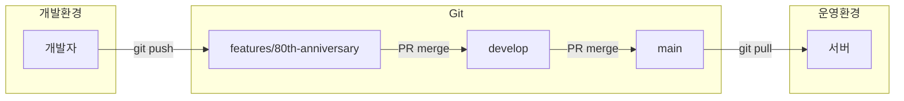

# SP100주년 뮤지엄 사이트 개발 소스 안내

> **상태**: Git 기반 공유 예정  
> **작성일**: 2026-04-20  
> **비고**: 삼화 측 유관 부서 검토 후 접근 권한 안내

---

## 1. 소스코드 개요

SP100주년 뮤지엄 사이트의 개발 소스는 Git 저장소를 통해 관리됩니다.

### 1.1 기본 정보

| 항목 | 내용 |
|------|------|
| **저장소 유형** | Git (Private) |
| **주요 브랜치** | main, develop, features/80th-anniversary |
| **산출물 브랜치** | features/output |
| **테마 경로** | `web/app/themes/sknk_80/` |

---

## 2. 브랜치 구조

```
main (운영 배포용)
│
├── develop (개발 통합)
│   │
│   ├── features/80th-anniversary (SP100주년 개발)
│   │
│   └── features/output (산출물 문서)
```

### 2.1 브랜치별 용도

| 브랜치 | 용도 | 배포 대상 |
|--------|------|-----------|
| `main` | 운영 서버 배포 | spsamhwa.com |
| `develop` | 개발 통합 및 테스트 | 스테이징 |
| `features/80th-anniversary` | SP100주년 기능 개발 | 개발 환경 |
| `features/output` | 산출물 문서 | - |

---

## 3. 디렉토리 구조

```
samhwa/
├── config/                    # WordPress 설정
├── docs/                      # 문서
│   └── museum/               # 뮤지엄 산출물
├── migration/                 # MIS 마이그레이션 YML
├── vendor/                    # Composer 의존성
└── web/
    └── app/
        ├── mu-plugins/       # Must-Use 플러그인
        │   └── museum-admin-menu.php
        ├── plugins/          # 플러그인
        │   └── advanced-custom-fields-pro/
        └── themes/
            ├── sknk/         # 부모 테마
            ├── sknk_en/      # 영문 차일드 테마
            └── sknk_80/      # 뮤지엄 차일드 테마 ★
                ├── functions.php
                ├── style.css
                ├── home.php
                ├── page-*.php
                ├── single-*.php
                ├── 404.php
                ├── inc/
                │   ├── register.php
                │   ├── ajax.php
                │   ├── event-cpt.php
                │   ├── event-comments.php
                │   └── event-comments-admin.php
                ├── twigs/
                │   ├── *.twig
                │   └── partials/
                └── src/
                    ├── css/
                    ├── js/
                    ├── images/
                    ├── videos/
                    └── fonts/
```

---

## 4. 소스 파일 목록

### 4.1 PHP 파일 (19개)

| 번호 | 파일명 | 라인 수 (추정) |
|------|--------|---------------|
| 1 | functions.php | ~50 |
| 2 | style.css | ~20 |
| 3 | home.php | ~30 |
| 4 | page-80-years.php | ~50 |
| 5 | page-sp-samhwa.php | ~40 |
| 6 | page-first-best.php | ~40 |
| 7 | page-future.php | ~40 |
| 8 | page-philosophy.php | ~40 |
| 9 | page-history.php | ~40 |
| 10 | page-heritage.php | ~40 |
| 11 | page-event.php | ~50 |
| 12 | page-coming-soon.php | ~30 |
| 13 | single-event.php | ~60 |
| 14 | single-winner.php | ~50 |
| 15 | 404.php | ~20 |
| 16 | inc/register.php | ~100 |
| 17 | inc/ajax.php | ~80 |
| 18 | inc/event-cpt.php | ~80 |
| 19 | inc/event-comments.php | ~150 |

### 4.2 Twig 파일 (16개)

| 번호 | 파일명 |
|------|--------|
| 1 | home.twig |
| 2 | 80-years.twig |
| 3 | sp-samhwa.twig |
| 4 | first-best.twig |
| 5 | future.twig |
| 6 | philosophy.twig |
| 7 | event.twig |
| 8 | single-event.twig |
| 9 | single-winner.twig |
| 10 | coming-soon.twig |
| 11 | 404.twig |
| 12 | partials/anniversary-header.twig |
| 13 | partials/anniversary-footer.twig |
| 14 | partials/mega-menu.twig |
| 15 | partials/btn-top.twig |
| 16 | partials/sub-banner.twig |

### 4.3 JavaScript 파일 (15개+)

| 번호 | 파일명 |
|------|--------|
| 1 | 80.js |
| 2 | 80-years.js |
| 3 | 80-years.core.js |
| 4 | 80-years.lenis.js |
| 5 | 80-years.snap.js |
| 6 | 80-years.intro.js |
| 7 | 80-years.page.js |
| 8 | sp-samhwa.js |
| 9 | first-best.js |
| 10 | future.js |
| 11 | philosophy.js |
| 12 | history-scroll.js |
| 13 | event-lenis.js |
| 14 | event-comments.js |
| 15 | wheel-canvas.js |
| 16 | common/intro.js |
| 17 | common/accent-utils.js |
| 18 | common/curtain-utils.js |

---

## 5. 접근 권한 안내

### 5.1 현재 상태

소스코드 접근 권한은 다음 절차를 거쳐 안내될 예정입니다:

1. 삼화 측 유관 부서 검토
2. 접근 권한 범위 결정
3. Git 계정 생성 또는 권한 부여
4. 접근 방법 안내

### 5.2 요청 시 필요 정보

| 항목 | 설명 |
|------|------|
| 담당자명 | 소스 접근이 필요한 담당자 |
| 이메일 | Git 계정 생성용 |
| 목적 | 접근 목적 (유지보수, 검토 등) |
| 기간 | 접근 필요 기간 |

---

## 6. 개발 환경 구성

### 6.1 요구사항

| 항목 | 버전 |
|------|------|
| Git | 2.x+ |
| GitHub 계정 | 승인된 계정 필요 |
| PHP | 8.1+ |
| MySQL | 8.0+ |
| Node.js | 18+ (선택) |
| Composer | 2.x |
| DDEV | 1.21+ (권장) |

> **필수**: 프로젝트 클론을 위해 승인된 GitHub 계정이 필요합니다. 권한이 없는 경우 [5. 접근 권한 안내](#5-접근-권한-안내)를 참고하세요.

### 6.2 로컬 환경 설정

#### Git 저장소 정보

| 항목 | 내용 |
|------|------|
| **저장소 URL** | https://github.com/sknkwoxs/samhwa/ |
| **접근 권한** | 승인된 GitHub 계정만 접근 가능 |

> **참고**: Private 저장소이므로 접근 권한이 없는 경우 [5. 접근 권한 안내](#5-접근-권한-안내)를 참고하여 권한을 요청하세요.

#### 설정 절차

```bash
# 1. 저장소 클론 (권한 부여 후)
git clone https://github.com/sknkwoxs/samhwa/ samhwa
cd samhwa

# 2. DDEV 시작
ddev start

# 3. 의존성 설치
ddev composer install

# 4. DB 스냅샷 복원
ddev snapshot restore --latest

# 5. 사이트 접속
open https://samhwa.sknkwoxs.com/museum/
```

---

## 7. 환경 설정 (.env)

### 운영 환경 설정 예시

```bash
# 데이터베이스
DB_NAME='samhwa_db'
DB_USER='db_user'
DB_PASSWORD='********'
DB_HOST='localhost'

# WordPress
WP_ENV='production'
WP_HOME='https://spsamhwa.com'
WP_SITEURL='https://spsamhwa.com/wp'

# 멀티사이트
WP_ALLOW_MULTISITE=true
MULTISITE=true
SUBDOMAIN_INSTALL=false        # 서브디렉토리 방식
DOMAIN_CURRENT_SITE='spsamhwa.com'
PATH_CURRENT_SITE='/'
SITE_ID_CURRENT_SITE=1
BLOG_ID_CURRENT_SITE=1
```

> **주의**: `.env` 파일은 Git에 포함되지 않습니다. 서버에서 직접 관리하세요.

---

## 8. 배포 절차

### Git 기반 배포 흐름



### 배포 명령어 (운영 서버)

```bash
# 운영 서버 SSH 접속
ssh user@spsamhwa.com

# 프로젝트 디렉토리 이동
cd /var/www/samhwa

# 최신 코드 가져오기
git pull origin main

# Composer 업데이트 (필요시)
composer install --no-dev --optimize-autoloader

# 캐시 클리어 (필요시)
wp cache flush --url=spsamhwa.com/museum
```

---

## 9. 데이터베이스 관리

### DB 접속 정보

| 항목 | 운영 | 개발 |
|------|------|------|
| 호스트 | localhost | ddev-samhwa-db |
| 포트 | 3306 | 3306 |
| DB명 | samhwa_db | db |
| 사용자 | (보안) | db |

### 테이블 접두사

| blog_id | 접두사 | 사이트 |
|---------|--------|--------|
| 1 | wp_ | 국문 |
| 2 | wp_2_ | 영문 |
| 3 | wp_3_ | 뮤지엄 |

### WP-CLI DB 명령어

```bash
# 뮤지엄 사이트 대상 명령어
# --url 옵션으로 대상 사이트 지정

# DB 내보내기
wp db export museum-backup.sql --url=spsamhwa.com/museum

# DB 가져오기
wp db import museum-backup.sql

# URL 치환 (개발 → 운영)
wp search-replace 'samhwa.sknkwoxs.com/museum' 'spsamhwa.com/museum' \
    --url=spsamhwa.com/museum

# 캐시 클리어
wp cache flush --url=spsamhwa.com/museum
```

---

## 10. 백업 및 복구

### 백업 대상

| 대상 | 경로/방법 | 주기 |
|------|----------|------|
| 데이터베이스 | `wp db export` | 일간 |
| 업로드 파일 | `/web/app/uploads/sites/3/` | 주간 |
| 테마 파일 | Git 저장소 | 실시간 |
| 설정 파일 | `.env`, `config/` | 변경 시 |

### 백업 스크립트 예시

```bash
#!/bin/bash
# museum-backup.sh

DATE=$(date +%Y%m%d)
BACKUP_DIR="/backups/museum"

# DB 백업
wp db export ${BACKUP_DIR}/db-${DATE}.sql --url=spsamhwa.com/museum

# 업로드 파일 백업
tar -czf ${BACKUP_DIR}/uploads-${DATE}.tar.gz \
    /var/www/samhwa/web/app/uploads/sites/3/

# 30일 이상 된 백업 삭제
find ${BACKUP_DIR} -type f -mtime +30 -delete
```

### 복구 절차

```bash
# 1. DB 복구
wp db import /backups/museum/db-20260420.sql

# 2. URL 치환 (필요시)
wp search-replace 'old-domain.com' 'spsamhwa.com' \
    --url=spsamhwa.com/museum

# 3. 캐시 클리어
wp cache flush --url=spsamhwa.com/museum

# 4. 업로드 파일 복구 (필요시)
tar -xzf /backups/museum/uploads-20260420.tar.gz -C /
```

---

## 11. 트러블슈팅

### 일반적인 문제

| 증상 | 원인 | 해결 방법 |
|------|------|----------|
| 500 에러 | PHP 에러 | `/var/log/nginx/error.log` 확인 |
| 404 에러 | Rewrite 규칙 | Nginx 설정 확인 |
| 흰 화면 | PHP 메모리 | `memory_limit` 증가 |
| 로그인 루프 | 쿠키 문제 | 브라우저 캐시 클리어 |
| 이미지 깨짐 | 업로드 권한 | `uploads/` 권한 755 |

### 로그 확인

```bash
# Nginx 에러 로그
tail -f /var/log/nginx/error.log

# PHP 에러 로그
tail -f /var/log/php/error.log

# WordPress 디버그 로그
tail -f /var/www/samhwa/web/app/debug.log
```

### 디버그 모드 활성화

```php
// config/application.php
define('WP_DEBUG', true);
define('WP_DEBUG_LOG', true);
define('WP_DEBUG_DISPLAY', false);
```

---

## 12. WP-CLI 명령어 모음

### 사이트 관리

```bash
# 사이트 목록
wp site list

# 테마 목록
wp theme list --url=spsamhwa.com/museum

# 플러그인 목록
wp plugin list --url=spsamhwa.com/museum

# 사용자 목록
wp user list
```

### 옵션 및 포스트

```bash
# 옵션 조회
wp option get blogname --url=spsamhwa.com/museum
wp option get siteurl --url=spsamhwa.com/museum

# 포스트 타입별 개수
wp post list --post_type=event --url=spsamhwa.com/museum --format=count
wp post list --post_type=winner --url=spsamhwa.com/museum --format=count
```

### 캐시 및 유지보수

```bash
# 캐시 클리어
wp cache flush --url=spsamhwa.com/museum

# 트랜지언트 삭제
wp transient delete --all --url=spsamhwa.com/museum

# 리비전 삭제
wp post delete $(wp post list --post_type='revision' --format=ids) --url=spsamhwa.com/museum
```

---

## 13. 문의처

| 구분 | 연락처 |
|------|--------|
| **개발사** | 스컹크웍스 |
| **이메일** | developer@skunkworks.co.kr |
| **문의 내용** | 소스 접근 권한, 기술 문의 |

---

## 14. 참고 문서

- `docs/museum/01-코딩가이드.md` - 코딩 컨벤션
- `docs/museum/05-프로그램목록정의서.md` - 프로그램 상세
- `docs/multisite-add-museum.md` - 멀티사이트 구성
- `docs/deploy-museum-to-production.md` - 배포 절차
