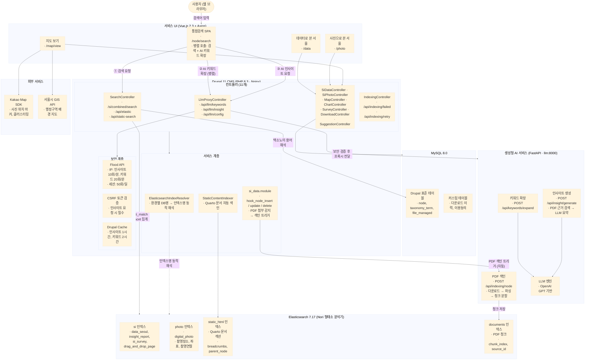
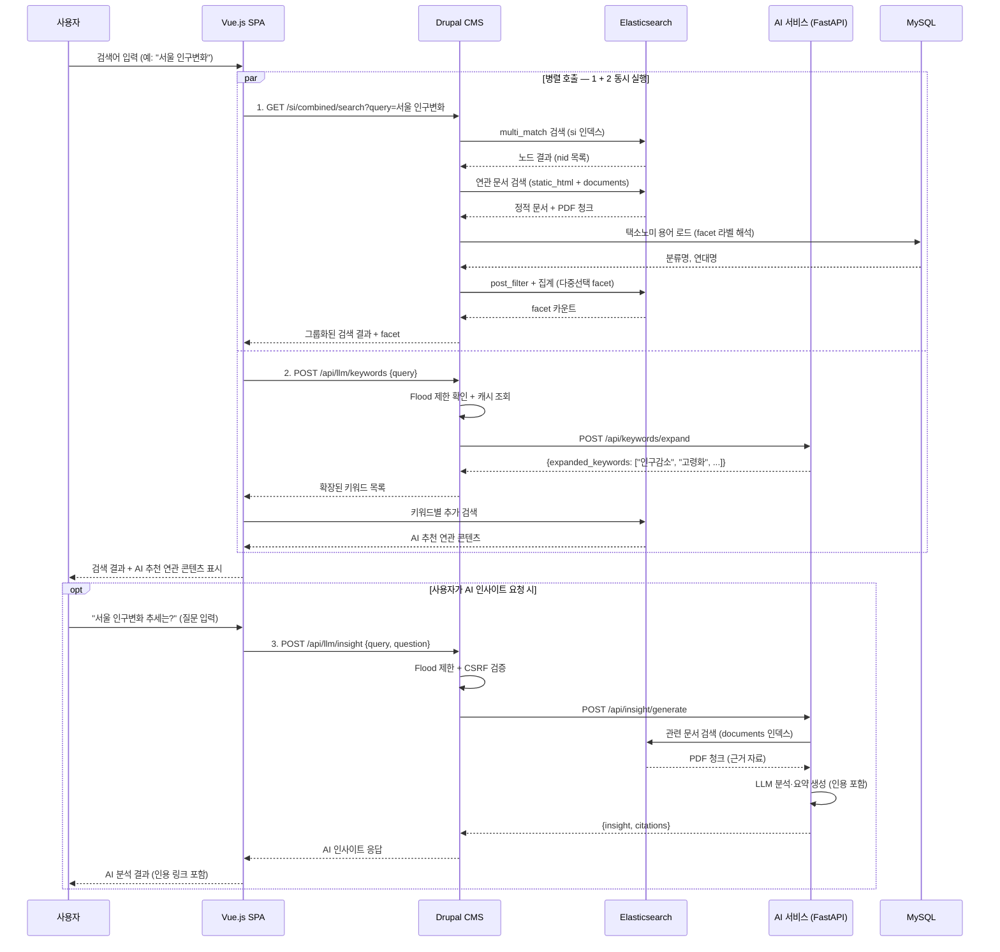
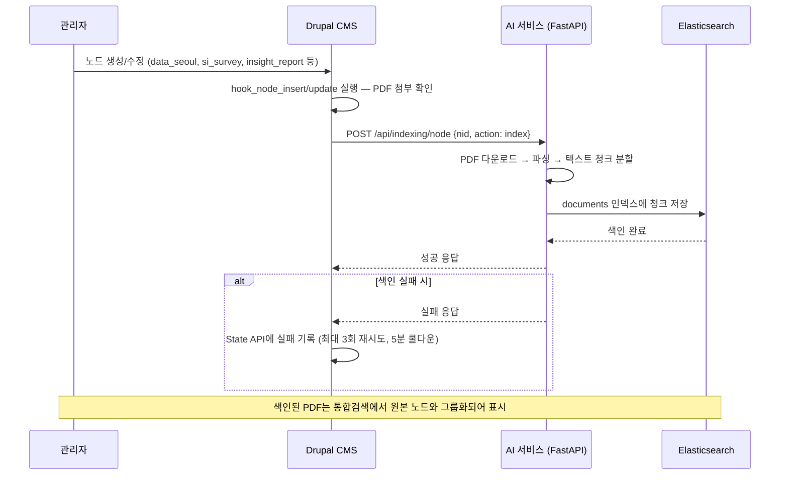

> [SI-DATA 문서](../)

서울연구데이터서비스(data.si.re.kr) 통합검색엔진 **시스템 구성도**입니다.
Drupal CMS, Elasticsearch, 생성형 AI(FastAPI), MySQL, 서비스 UI 간의 연계 흐름을 정리합니다.

---

## 1. 전체 시스템 구성도

---

## 2. 컴포넌트별 역할

| 계층 | 컴포넌트 | 기술 스택 | 역할 |
|------|----------|-----------|------|
| **서비스 UI** | Vue.js SPA | Vue 2.3, Axios | 통합검색 화면, 검색결과·AI 인사이트 표시, facet 필터 |
| **CMS** | Drupal 11 | PHP 8.3, Nginx | 콘텐츠 관리, API 라우팅, 보안 프록시, 택소노미 관리 |
| **검색엔진** | Elasticsearch 7.17 | Nori 형태소 분석기, 4개 인덱스 | 전문검색(fuzzy), 다중 인덱스 통합검색, facet 집계 |
| **관계형 DB** | MySQL 8.0 | Drupal Schema | 노드·택소노미 저장, 다운로드 이력, 이용동의 |
| **생성형 AI** | FastAPI | Docker(llm:8000) | 키워드 확장, AI 인사이트, PDF 파싱·청크 색인 |
| **외부 API** | Kakao Map, 서울GIS | JavaScript SDK | 사진 위치 지도, 서울시 배경 지도 |

---

## 3. Elasticsearch 인덱스 구조

4개 인덱스가 역할별로 분리 운영됩니다. 인덱스명은 `ElasticsearchIndexResolver`가 환경별 DB 이름을 반영해 동적으로 해석합니다.

| 인덱스 | 관리 주체 | 대상 콘텐츠 | 주요 필드 |
|--------|-----------|-------------|-----------|
| `si` | Search API | data_seoul, insight_report, si_survey, drag_and_drop_page | title, body, field_category_data, field_service, created |
| `photo` | Search API | digital_photo | title, 촬영장소, 좌표(x/y), 촬영연월, 컬렉션 |
| `static_html` | StaticContentIndexer | Quarto 문서 섹션 | section, text, breadcrumbs, parent_node |
| `documents` | FastAPI LLM | PDF 청크 | title, body, file_name, chunk_index, source_id |

---

## 4. 통합검색 데이터 흐름

사용자가 검색어를 입력했을 때의 처리 순서입니다. **검색 요청**과 **AI 키워드 확장**이 **병렬**로 동시 실행됩니다.

---

## 5. PDF 자동 색인 흐름

관리자가 콘텐츠를 등록·수정하면 첨부 PDF가 자동으로 파싱되어 검색 가능해집니다.

---

## 6. 보안 및 요청 제한

AI 서비스 호출은 `LlmProxyController`를 통해 다층 보안이 적용됩니다.

| 보안 계층 | 방식 | 설정 |
|-----------|------|------|
| **Referer 검증** | 허용 호스트만 통과 | `data.si.re.kr`, `si-data.ddev.site` |
| **IP 요청 제한** | Flood API | 인사이트 10회/분, 키워드 20회/분 |
| **세션 제한** | Flood API | 50회/일 |
| **CSRF 토큰** | 토큰 검증 | 인사이트 요청 시 필수 |
| **응답 캐싱** | Drupal Cache | 인사이트 1시간, 키워드 2시간 |

---

## 7. API 엔드포인트 전체 목록

### 검색 관련

| 엔드포인트 | 메서드 | 컨트롤러 | 설명 |
|------------|--------|----------|------|
| `/node/search` | GET | SearchController | 통합검색 페이지 (Vue.js SPA) |
| `/si/combined/search` | GET | SearchController | 노드 기준 그룹화 검색 + facet |
| `/api/elastic` | POST | SearchController | ES 프록시 (data/photo) |
| `/api/static-search` | GET/POST | SearchController | 정적 콘텐츠 + PDF 검색 |

### AI 관련

| 엔드포인트 | 메서드 | 컨트롤러 | 설명 |
|------------|--------|----------|------|
| `/api/llm/config` | GET | LlmProxyController | AI 서비스 설정 조회 |
| `/api/llm/keywords` | POST | LlmProxyController | 키워드 확장 (연관 검색어) |
| `/api/llm/insight` | POST | LlmProxyController | AI 인사이트 생성 |
| `/api/indexing/failed` | GET | IndexingController | 실패 색인 큐 조회 |
| `/api/indexing/retry` | POST | IndexingController | 실패 색인 재시도 |

### 데이터·사진·지도

| 엔드포인트 | 메서드 | 컨트롤러 | 설명 |
|------------|--------|----------|------|
| `/data` | GET | SiDataController | 데이터로 본 서울 메인 |
| `/photo` | GET | SiPhotoController | 사진으로 본 서울 메인 |
| `/map/view` | GET | MapController | 지도 보기 (Kakao Map + 서울GIS) |
| `/map/markers` | GET | MapController | 사진 마커 (좌표 범위 검색) |

---

## 8. 핵심 흐름 요약

| # | 흐름 | 경로 | 설명 |
|---|------|------|------|
| 1 | **통합검색** | 사용자 → Vue.js → Drupal → ES 4개 인덱스 → 결과 그룹화 + facet | 노드 기준으로 관련 문서를 묶어 표시 |
| 2 | **AI 연관검색** | 사용자 → Drupal 프록시(보안) → FastAPI → LLM → 키워드 → ES 추가 검색 | 검색과 **병렬 실행**, "AI 추천 연관 콘텐츠" 표시 |
| 3 | **AI 인사이트** | 사용자 질문 → Drupal 프록시 → FastAPI → PDF 인덱스 근거 검색 → LLM 요약 | 인용 출처 포함 분석 결과 |
| 4 | **PDF 자동 색인** | 관리자 콘텐츠 등록 → Drupal 훅 → FastAPI → PDF 파싱·청크 → ES 저장 | 등록 즉시 검색 가능 |
