# 시스템 아키텍처

한국자원봉사아카이브(archives.v1365.or.kr)의 시스템 구조와 기술 스택에 대한 상세 분석 내용입니다.

---

## 플랫폼 개요 (Omeka Classic)

- **Omeka Classic**: 디지털 아카이브 및 박물관 전용으로 설계된 오픈소스 콘텐츠 관리 시스템(CMS)입니다.
- **Framework**: Zend Framework 1 기반으로 구축되었으나, 현재 해당 프레임워크는 EOL(End of Life) 상태로 공식 지원이 종료되었습니다.
- **ORM**: Active Record 패턴(`Omeka_Record_AbstractRecord`)을 사용하여 데이터베이스를 관리합니다.
- **Plugin System**: Hook과 Filter 기반의 이벤트 시스템을 통해 기능을 확장합니다.
- **License**: GPL v3 라이선스를 따릅니다.

---

## 서버 환경

| 구성 요소 | 기술 | 비고 |
|-----------|------|------|
| 웹서버 | Apache | mod_rewrite 모듈 필수 활성화 |
| 언어 | PHP 7.1+ | PHP 8.4 이상 버전은 현재 미지원 |
| 데이터베이스 | MySQL 5.5.5+ / MariaDB | InnoDB 엔진 사용, UTF-8 인코딩 |
| 검색 엔진 | Apache Solr | SolrSearch 플러그인을 통한 통합 운영 |
| 이미지 처리 | ImageMagick 6.7.5+ | 썸네일 및 파생 이미지 생성 |
| OS | Linux | 공식 권장 및 지원 환경 |

---

## 시스템 구성도

---

## 설치된 플러그인

| 플러그인 | 용도 | 확인 방법 |
|---------|------|----------|
| SolrSearch | 패싯(Facet) 기반 전문 검색 제공 | /solr-search URL 패턴 확인 |
| ExhibitBuilder | 온라인 전시(Exhibition) 콘텐츠 구축 | /exhibits/ URL 패턴 확인 |
| Contribution | 사용자 콘텐츠 기여 (기록 기증, 칼럼 제보 등) | /contribution/ URL 패턴 확인 |
| SimplePages | 정적 페이지 (소개, 새소식, 이용약관 등) 관리 | /about, /notice, /terms 등 고정 경로 |

---

## 테마 구조

- **커스텀 테마**: `v1365`라는 이름의 커스텀 테마를 사용 중입니다. (`/themes/v1365/`)
- **템플릿 엔진**: Omeka Classic 표준에 따라 PHP 템플릿(`.phtml`) 파일을 기반으로 렌더링됩니다.
- **로그인 상태 식별**: 관리자 로그인 시 `body` 태그의 클래스에 `admin-bar`가 포함되며, 일반적인 클래스 구성은 `admin-bar group home pc` 형태를 띱니다.

---

## 프론트엔드 기술 스택

| 라이브러리 | 버전 | 용도 | 로딩 방식 |
|-----------|------|------|----------|
| jQuery | 3.6.0 | DOM 조작 및 이벤트 처리 | CDN (현재 2번 중복 로드되는 이슈 있음) |
| Swiper | v11 | 메인 슬라이더 및 캐러셀 UI | CDN |
| Alpine.js | latest | 경량 선언적 UI 프레임워크 | unpkg |
| AOS | next | 스크롤 애니메이션 효과 | unpkg |
| Tailwind CSS | - | 유틸리티 퍼스트 스타일링 | style-build.css 파일로 빌드됨 |
| XEIcon | - | 아이콘 폰트 라이브러리 | 커스텀 로컬 로딩 |

### 외부 서비스 연동

| 서비스 | 식별자 | 용도 |
|--------|-------|------|
| Google Tag Manager | GTM-WXWWDMLR | 통합 태그 관리 및 스크립트 삽입 |
| Google Analytics | G-B0TPXN7YK9 | 방문자 트래픽 및 행동 분석 |
| Google Translate | API | 웹사이트 다국어 번역 위젯 기능 |

---

## 보안 설정

- **전송 보안**: 전 구간 HTTPS 암호화 통신 적용
- **HSTS**: HTTP Strict Transport Security 헤더 활성화로 강제 보안 접속 유지
- **Clickjacking 방지**: `X-Frame-Options: SAMEORIGIN` 설정 적용
- **MIME 스니핑 방지**: `X-Content-Type-Options: nosniff` 설정 적용
- **API 보안**: REST API 비인증 접근 시 `403 Forbidden` 응답으로 데이터 보호

---

## 기술적 평가 요약

| 구분 | 주요 내용 |
|------|-----------|
| **강점** | • 문화유산 분야에 최적화된 메타데이터 모델 보유 • Dublin Core 표준 완벽 준수 • 600개 이상의 방대한 플러그인 생태계 • Solr 연동을 통한 고급 검색 및 패싯 기능 제공 |
| **약점(치명적)** | • 기반 프레임워크(Zend Framework 1)의 EOL로 인한 보안 패치 중단 • 최신 PHP 8+ 버전을 지원하지 않아 서버 환경 최신화 제약 • 단일 서버 구조로 인한 수평 확장(Horizontal Scaling) 불가능 • 전용 캐싱 레이어 부재로 대규모 접속 시 성능 저하 우려 • 클라우드 객체 스토리지(S3 등) 공식 미지원 |
