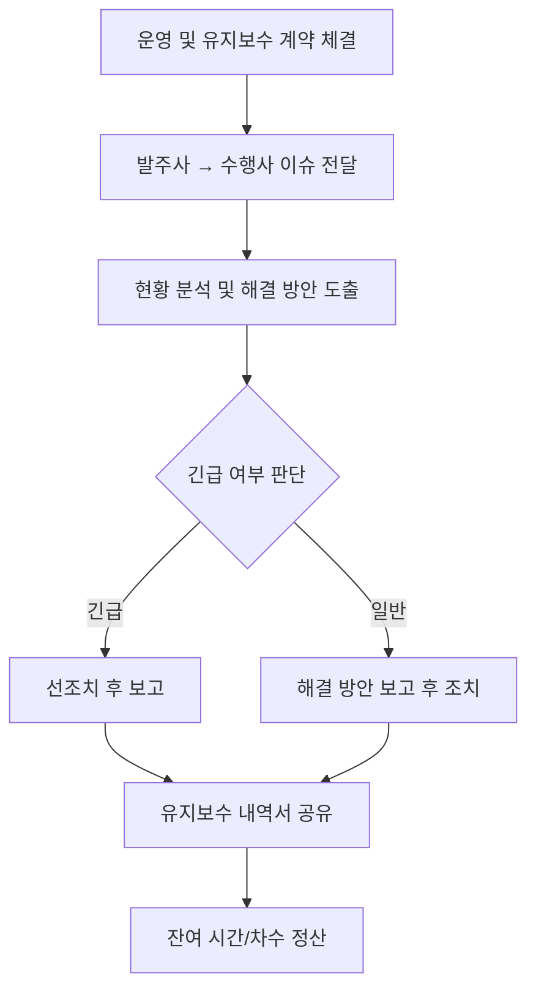

# 운영유지 가이드 및 프로세스

본 문서는 한국자원봉사아카이브(v1365) 시스템의 안정적인 운영과 지속적인 유지관리를 위한 표준 절차를 정의합니다. 유지보수 수행사인 스컹크웍스스튜디오(SKNK Works Studio)의 운영유지 범위, 과업 체계, 진행 프로세스 및 계약 방식을 포함합니다.

:::note[하위 문서 바로가기]
*   [시스템 업데이트 실행 가이드](./system-update/) — 범위 01/02/03별 구체적인 실행 절차
*   [정기 유지보수](./regular-maintenance/) — 인프라 관리, 백업, 호스팅/SSL/도메인, 보고서
*   [모니터링 및 장애 대응](./monitoring/) — 상태 점검, 이슈 분류, 에스컬레이션, 장애 대응
:::

---

## 1. 운영 및 유지보수란?

개발 과업이 종료된 후 납품된 산출물(웹사이트, 모바일 앱, 웹 서비스 등)의 지속적이고 안정적인 운영을 위해 주요 개발과는 별도로 협의하여 체결되는 계약입니다.

*   **업무 대행**: 고객사 내부 운영 인력 부재 시 발생하는 관리 업무 수행
*   **시스템 안정화**: 납품된 시스템이 안정 궤도에 오를 때까지 기술 지원
*   **범위 내 개발**: 계약된 기간과 범위 내에서 기능 수정, 페이지 제작, 내용 수정 등을 제공

---

## 2. 운영유지 범위

스컹크웍스스튜디오가 수행하는 운영 유지보수는 다음 3가지 범위로 구분됩니다.

### 01. CMS 코어 및 모듈 보안 업데이트
*   Omeka Classic 코어 최신 보안 업데이트 적용
*   구성 플러그인(SolrSearch, ExhibitBuilder 등)의 최신 보안 패치 적용
*   운영 서버 내 업데이트 반영 후 정상 동작 보증

### 02. 웹사이트 정보 업데이트
*   기존 페이지의 텍스트 및 이미지 원고 수정
*   이벤트 팝업, 공지 배너 등 추가 요소 제작 및 게시
*   신규 단순 페이지(Simple Pages) 제작 및 메뉴 구성

### 03. 기능 수정 및 개선
*   내부 데이터 마이그레이션 결과값 오류 대응
*   웹사이트 내 구현된 기능 향상 및 버그 대응
*   기타 운영과 관련된 개선 사항 및 필요 요구 기능의 추가 개발 (계약 범위 내)

---

## 3. 운영유지 과업 요약표

### 01. CMS 코어 및 모듈 보안 업데이트

| 세부 항목 | 주기 | 비고 |
| :--- | :--- | :--- |
| Omeka Classic 코어 보안 패치 적용 | 패치 발생 시 | 정상 동작 보증 |
| 플러그인 보안 패치 적용 | 패치 발생 시 | SolrSearch, ExhibitBuilder 등 |

### 02. 웹사이트 정보 업데이트

| 세부 항목 | 주기 | 비고 |
| :--- | :--- | :--- |
| 페이지 텍스트/이미지 수정 | 수시 | 센터 제공 자료 기반 |
| 메인 이미지/영상 교체 | 수시 | 센터 제공 자료 기반 |
| 이벤트 팝업/공지 배너 제작 | 수시 | |
| 신규 단순 페이지 및 메뉴 구성 | 수시 | |

### 03. 기능 수정 및 개선

| 세부 항목 | 주기 | 비고 |
| :--- | :--- | :--- |
| 데이터 마이그레이션 오류 대응 | 발생 시 | |
| 기존 기능 버그 수정 | 발생 시 | |
| DB 기록 정보 및 분류체계 수정 | 수시 | |
| 목록 및 파일 일괄 입수 | 반기 1회 | |

### 정기 유지보수

| 세부 항목 | 주기 | 비고 |
| :--- | :--- | :--- |
| 시스템 모니터링 및 성능 튜닝 | 수시 | 범위 01~03 안정 운영 기반 |
| 호스팅/SSL/도메인 관리 | 연 1회 | 만료 전 갱신 |
| 장애 대응 및 복구 | 즉시 | 긴급: 선조치 후 보고 |
| 유지보수 결과 보고서 제출 | 반기 1회 | |

---

## 4. 운영유지 진행 프로세스

이슈 발생 시 다음과 같은 표준 프로세스에 따라 처리됩니다.

1.  **계약 체결**: 과업 범위와 기간 확정
2.  **요청 전달**: 운영 유지 시트 또는 공식 채널을 통한 요청 사항 접수
3.  **현황 분석**: 기술적 타당성 및 작업 분량 분석
4.  **조치**: 보고 후 해결 (긴급 상황 시 즉시 대응)
5.  **내역 공유**: 전자문서 형태의 유지보수 리포트 전달
6.  **정산**: 투입 시간 차감

---

## 5. 계약 방식

### 계약 및 지불
*   **계약 방식**: 연 단위 계약 (기본 1년, 협의에 따라 변경 가능)
*   **지불 방식**: 분할 지급 계약을 통한 합의된 방식 적용
*   **지급 방법**: 지정 계좌로 현금 이체

### 서비스 제공
*   계약 기간 내 발생하는 운영 유지 이슈 대응
*   단, 기존 계약 범위를 벗어나는 대규모 추가 개발은 별도 계약 필요

:::tip[참고]
운영 유지보수와 관련된 모든 요청과 결과는 투명하게 기록되며, 정기적인 보고서를 통해 고객사에 공유됩니다.
:::
