# 모니터링 및 장애 대응

시스템의 안정적 운영을 위한 모니터링 체계와 장애 발생 시 대응 절차를 정의합니다.

---

## 정기 점검 항목

| 점검 항목 | 방법 | 주기 | 정상 기준 |
| :--- | :--- | :--- | :--- |
| **사이트 접속** | `https://archives.v1365.or.kr` 접속 | 수시 | HTTP 200, 3초 이내 응답 |
| **SSL 인증서** | 브라우저 인증서 정보 확인 | 월 1회 | 유효기간 30일 이상 잔여 |
| **디스크 사용량** | `df -h`, `du -sh /files/` | 월 1회 | 80% 미만 |
| **에러 로그** | Apache error.log, PHP error.log 점검 | 월 1회 | 반복 에러·5xx 에러 없음 |
| **MySQL 상태** | `SHOW PROCESSLIST`, slow query log | 월 1회 | 느린 쿼리 없음 |
| **Solr 검색** | 프론트엔드 검색 테스트 | 월 1회 | 검색 결과 정상 반환 |
| **Solr 색인 동기화** | 아이템 수와 색인 문서 수 비교 | 분기 1회 | 일치 |

---

## 이슈 분류 및 대응 시한

| 등급 | 기준 | 대응 시한 | 예시 |
| :--- | :--- | :--- | :--- |
| 🔴 **긴급** | 서비스 전면 장애, 데이터 유실 위험 | 즉시 (선조치 후 보고) | 서버 다운, SSL 만료, DB 장애, 보안 침해 |
| 🟠 **높음** | 주요 기능 장애 | 4시간 이내 | 검색 불가, 전시 오류, 아이템 등록 불가 |
| 🟢 **일반** | 경미한 오류, 수정 요청 | 영업일 2일 이내 | 텍스트/이미지 수정, 배너 제작, UI 깨짐 |

---

## 장애 대응 프로세스

:::danger[선조치 원칙]
서비스 중단이 발생한 긴급 상황에서는 고객사 사전 승인 없이 복구 조치를 우선 수행합니다. 조치 완료 후 즉시 상세 내역을 보고합니다.
:::

### 보고 체계

| 등급 | 보고 시점 | 보고 방식 |
| :--- | :--- | :--- |
| 🔴 긴급 | 인지 즉시 + 조치 후 | 유선 + 서면 |
| 🟠 높음 | 대응 착수 시 + 완료 시 | 이메일 또는 공식 채널 |
| 🟢 일반 | 처리 완료 시 | 유지보수 시트 기록 |

:::note[기록 관리]
모든 장애 대응 내역은 유지보수 내역서에 기록하며, 반기별 보고서에 포함합니다. 보고서 작성 절차는 [정기 유지보수](./regular-maintenance/)를 참고하십시오.
:::
