# 데이터 마이그레이션

한국자원봉사아카이브의 핵심 자산인 약 19,529건의 아이템과 관련 메타데이터를 **Drupal CMS**로 안전하게 이전하기 위한 계획을 수립합니다.

---

## 1. 현행 데이터 현황

| 데이터 구분 | 규모 (추정) | 설명 |
| :--- | :--- | :--- |
| **아이템** | 19,529건 | 핵심 아카이브 기록물 |
| **컬렉션** | 수십 건 | 18개 공동운영기관 및 주제별 분류 |
| **메타데이터** | 수십만 건 | 더블린 코어 표준 및 커스텀 항목 (목록구분, 주제분류 등) |
| **미디어 파일** | 수만 건 | 원본, 전체크기, 썸네일 등 4단계 이미지 |
| **전시** | 수십 건 | 큐레이션 콘텐츠 |
| **태그** | 수천 건 | 검색 및 분류용 키워드 |

---

## 2. 데이터 구조 전환 방향

현행 시스템의 데이터 구조를 Drupal에 맞게 재설계합니다.

| 현행 (Omeka Classic) | 전환 후 (Drupal) | 비고 |
| :--- | :--- | :--- |
| 아이템 (Item) | 기록물 콘텐츠 | 개별 아카이브 기록물 단위 |
| 컬렉션 (Collection) | 분류 체계 | 18개 공동운영기관 포함 |
| 메타데이터 (더블린 코어) | 표준 메타데이터 필드 | Title, Description, Creator 등 |
| 메타데이터 (커스텀) | 커스텀 필드 | 목록구분, 주제분류, 키워드 |
| 파일 (File) | 미디어 | 이미지, 문서 등 첨부 자원 |
| 전시 (Exhibit) | 전시 콘텐츠 | 시각적 레이아웃 편집 활용 |
| 태그 (Tag) | 태그 분류 | 기존 태그 체계 유지 |

### 데이터 흐름

---

## 3. 전환 절차

Drupal은 대규모 데이터 이전을 위한 전용 도구를 기본 제공합니다. 이를 활용하여 3단계로 진행합니다.

### 1단계: 추출

- 현행 데이터베이스에서 아이템, 메타데이터, 파일 정보를 추출합니다.
- 이미지 등 미디어 파일을 신규 서버로 복제합니다.

### 2단계: 변환

- 현행 메타데이터 항목을 Drupal의 콘텐츠 구조에 맞게 변환합니다.
- '공동운영기관' 정보를 Drupal의 분류 체계로 재배치합니다.
- 인코딩 오류, 깨진 링크, 중복 태그 등을 일괄 정리합니다.

### 3단계: 적재

- 변환된 데이터를 Drupal에 입력합니다.
- 대용량 파일은 순차적으로 처리하여 안정성을 확보합니다.
- 문제 발생 시 되돌리기(롤백) 기능으로 즉시 원상 복구합니다.

---

## 4. 데이터 무결성 검증

| 검증 항목 | 방법 | 성공 기준 |
| :--- | :--- | :--- |
| **수량 일치** | 이전 전/후 총 건수 비교 | 19,529건 일치 |
| **내용 일치** | 기관별 아이템 50건 무작위 확인 | 모든 메타데이터 값 일치 |
| **파일 연결** | 모든 미디어의 정상 표시 여부 확인 | 깨진 파일 0건 |
| **한글 깨짐** | 한글 및 특수문자 전수 조사 | 인코딩 오류 0건 |

---

## 5. 실행 체크리스트

- [ ] 현행 데이터베이스 전체 백업 완료
- [ ] 미디어 파일 전체 백업 및 원격지 전송 완료
- [ ] 더블린 코어 외 커스텀 메타데이터(목록구분, 주제분류, 키워드) 구조 정의 완료
- [ ] 시범 이전(100건) 수행 및 결과 보고
- [ ] 대용량 이미지 이전 시 서버 환경 최적화
- [ ] 최종 이전 후 검색 기능 정상 작동 확인
- [ ] 되돌리기(롤백) 테스트 수행 및 복구 절차 확인
