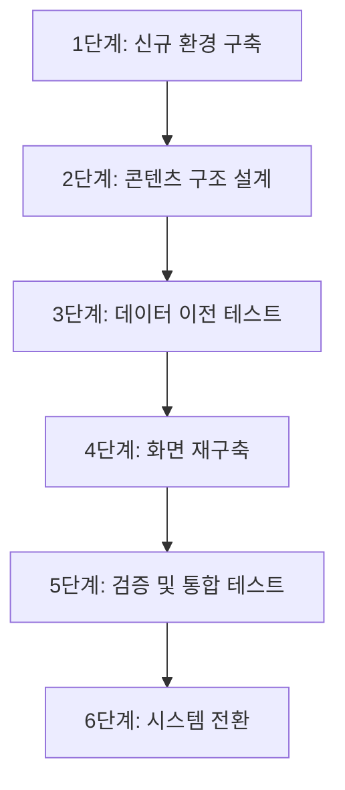

# 마이그레이션 전략

한국자원봉사아카이브의 지속 가능한 운영을 위해 노후화된 Omeka Classic 시스템을 **Drupal CMS**로 전환하는 마이그레이션 전략을 수립합니다.

---

## 1. CMS 플랫폼 비교 평가

현재의 아카이브 특성(디지털 에셋 관리, 더블린 코어 메타데이터, 18개 공동운영기관 구조 등)을 고려하여 4가지 대안을 검토하였습니다.

| 평가 기준 | Drupal | Omeka S | WordPress | 자체 개발 |
| :--- | :---: | :---: | :---: | :---: |
| **아카이브 적합성** | 🔴 최상 | 🔴 최상 | 🟡 중 | 🟢 하 |
| **한국어 지원** | 🔴 최상 (100+언어) | 🟡 중 | 🔴 최상 | 🔴 최상 |
| **확장성** | 🔴 최상 | 🟠 상 | 🟠 상 | 🔴 최상 |
| **관리자 편의성** | 🔴 최상 | 🟠 상 | 🔴 최상 | 🔴 최상 |
| **보안 체계** | 🔴 최상 (전담팀) | 🟡 중 | 🟠 상 | 🟡 중 |
| **외부 연동 (API)** | 🔴 최상 | 🟠 상 | 🟡 중 | 🔴 최상 |
| **전환 난이도** | 🟡 중 | 🟢 최저 | 🟠 상 | 🔴 최고 |
| **커뮤니티/생태계** | 🔴 최상 (4만+확장) | 🟡 중 | 🔴 최상 | - |

### 플랫폼별 특징 요약

- **Drupal**: 정부기관, 대학, 박물관 등에서 널리 사용되는 엔터프라이즈급 CMS입니다. 유연한 콘텐츠 구조 설계, 강력한 다국어 지원, 전담 보안팀 운영이 강점이며, 세계적 박물관/아카이브 기관(Smithsonian Institution 등)에서 검증되었습니다.
- **Omeka S**: Omeka Classic의 후속 버전으로 전환 비용이 가장 저렴하지만, 소규모 커뮤니티로 보안 업데이트가 비정기적이며 한국어 지원이 제한적입니다.
- **WordPress**: 전 세계 점유율 1위로 관리자 편의성이 뛰어나지만, 정교한 아카이브 메타데이터 구조를 구현하려면 많은 추가 개발이 필요합니다.
- **자체 개발**: 요구사항을 완벽히 수용할 수 있으나 개발 및 유지보수 비용이 과다합니다.

---

## 2. 권장 접근 방식: Drupal 도입

검토 결과, **Drupal CMS**로의 전환을 최우선 권장합니다.

### 선정 사유

1. **보안 지속성**: Drupal 전담 보안팀이 정기적으로 보안 권고를 발행하며, 취약점을 체계적으로 추적합니다. 현행 시스템의 보안 패치 중단 문제를 근본적으로 해결합니다.
2. **아카이브 분야 검증**: Drupal 기반의 디지털 리포지토리 플랫폼(Islandora)이 존재하여, 더블린 코어를 포함한 다양한 아카이브 메타데이터 표준을 기본 지원합니다.
3. **한국어 완전 지원**: 100개 이상 언어가 기본 내장되어 있어, 현행 41% 수준의 한국어 지원 문제를 해결합니다.
4. **유연한 콘텐츠 구조**: 아카이브 기록물의 메타데이터 구조를 자유롭게 설계할 수 있어, 현행 시스템의 구조적 제약에서 벗어납니다.
5. **확장성**: 캐싱, 클라우드 스토리지, 수평 확장을 지원하여 향후 트래픽 증가에 대응할 수 있습니다.
6. **현대적 관리 환경**: 반응형 관리자 화면을 기본 제공하며, 시각적 레이아웃 편집 기능으로 관리자의 업무 효율을 높입니다.

### Omeka S 대비 Drupal을 권장하는 이유

Omeka S는 전환 비용이 가장 저렴하지만, 장기적 관점에서 다음의 차이가 있습니다.

| 비교 항목 | Drupal | Omeka S |
| :--- | :--- | :--- |
| 보안 업데이트 | 전담팀, 정기 발행 | 소규모 커뮤니티, 비정기 |
| 한국어 지원 | 기본 100% | 제한적 |
| 관리자 화면 | 반응형, 시각적 편집 지원 | 기본 UI |
| 확장 생태계 | 4만+ 확장 모듈 | 수백 개 |
| 검색 기능 | 한국어 형태소 분석 지원 가능 | 기본 검색 |
| 장기 지속성 | 20년+ 역사, 대규모 커뮤니티 | 상대적 소규모 |

---

## 3. 전환 단계별 프로세스

1. **신규 환경 구축**: 현행 서버와 별도의 독립된 테스트 환경에 Drupal을 설치합니다.
2. **콘텐츠 구조 설계**: 현행 데이터 구조(더블린 코어, 커스텀 메타데이터)를 Drupal에 맞게 재설계합니다.
3. **데이터 이전 테스트**: 샘플 데이터를 사용하여 메타데이터 매핑 및 파일 연결 상태를 확인합니다. 상세 내용은 [데이터 마이그레이션](./data-migration/) 문서를 참고합니다.
4. **화면 재구축**: 현대적인 사용자 화면을 구축합니다. 상세 내용은 [프론트엔드 재구축](./frontend-rebuild/) 문서를 참고합니다.
5. **검증 및 통합 테스트**: 일정 기간 두 시스템을 동시에 운영하며 데이터와 기능을 검증합니다.
6. **시스템 전환**: 도메인(DNS) 전환을 통해 최종적으로 신규 시스템으로 서비스를 이전합니다.

---

## 4. 소요 리소스 및 리스크 관리

### 소요 리소스 (추정)

- **인력**: PM/기획 1명, CMS 전문가 1명, 프론트엔드 개발자 1명
- **인프라**: 신규 호스팅 서버(또는 클라우드), 스토리지 확장분
- **예산**: 인건비, 인프라 비용, 호스팅 비용 등

### 리스크 완화 전략

| 리스크 | 대응 방안 |
| :--- | :--- |
| **데이터 손실** | 전환 도구의 롤백(되돌리기) 기능 활용, 다중 백업 수행 및 검증 |
| **일정 지연** | 각 단계별 마일스톤 설정 및 주간 진행 상황 점검 |
| **기능 호환성** | 기존 기능 대체 방안 사전 확보 (검색, 전시 페이지 등) |
| **관리자 적응** | 관리자 교육 프로그램 수립, 사용자 매뉴얼 제작 |

---

## 5. 복구 계획 (Rollback Plan)

전환 작업 중 치명적인 결함 발견 시 즉시 이전 상태로 복구하기 위한 절차입니다.

1. **전체 백업**: 전환 직전 서버 및 DB 전체 스냅샷 생성
2. **DNS 사전 준비**: 전환 24시간 전 DNS 설정을 조정하여 복구 속도 확보
3. **점검 페이지**: 복구 작업 중 사용자에게 공지할 점검 페이지 상시 대기
4. **단계별 검증**: 각 단계 통과 실패 시 즉각 작업 중단 및 원상 복구 수행
